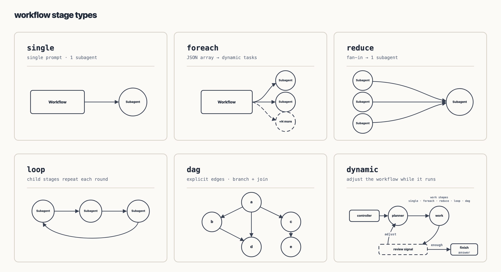
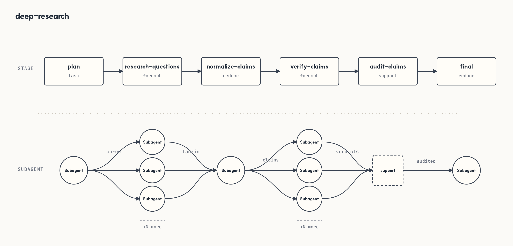
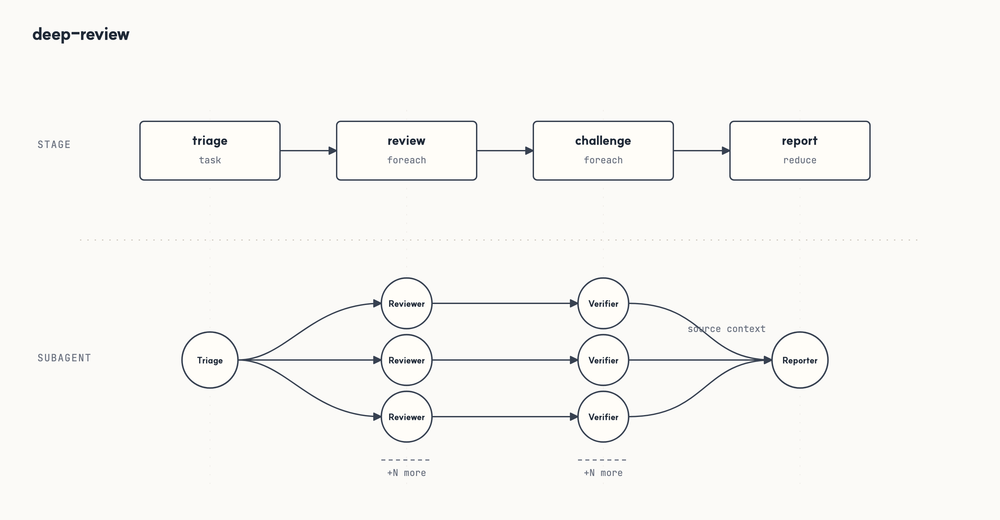
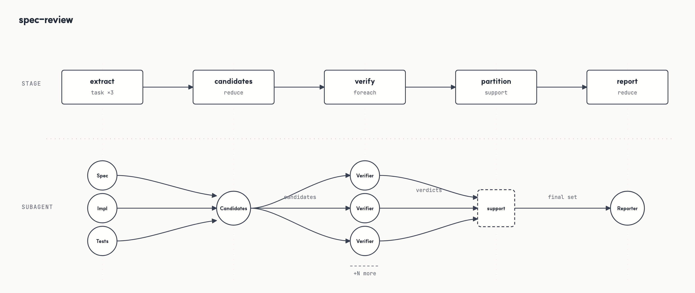
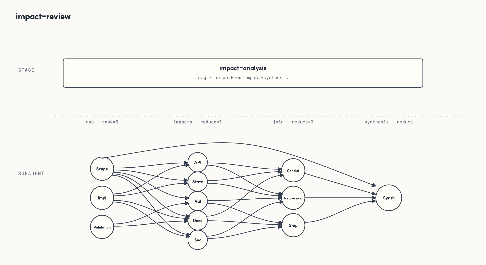
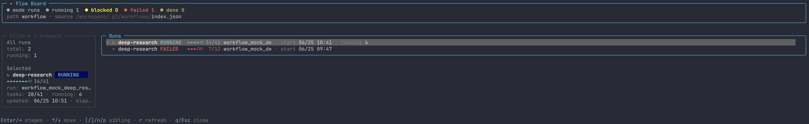
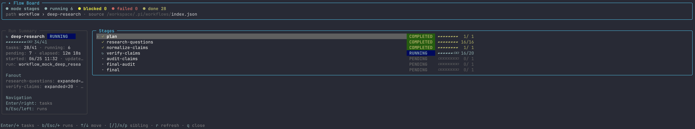
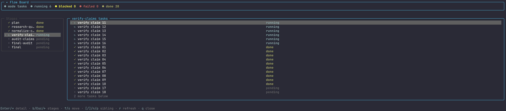
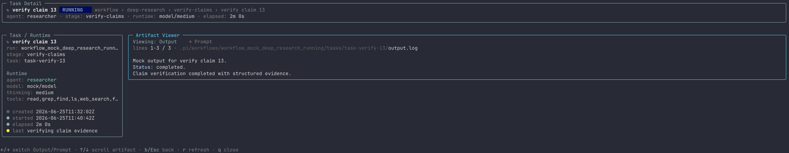

<p align="center">
  
</p>

<h1 align="center">pi-workflow</h1>

<p align="center"><strong>Workflow orchestration for Pi.</strong></p>

<p align="center">
  <a href="https://www.npmjs.com/package/@agwab/pi-workflow"></a>
</p>

`pi-workflow` lets Pi run named, repeatable multi-step workflows: research, code review, spec conformance checks, impact review, and project-specific team routines.

Built on [`@agwab/pi-subagent`](https://github.com/AgwaB/pi-subagent), it coordinates Pi subagent workers across workflow steps, passes results between them, and records the run so it can be inspected, stopped, or resumed.

You choose a workflow and describe the task in natural language.

## Installation

Install the package:

```bash
pi install npm:@agwab/pi-workflow
```

Then reload Pi.

This installs:

- the `/workflow` extension
- the bundled `workflow-guide` skill
- the bundled `execution-router` skill

To update later:

```bash
pi update npm:@agwab/pi-workflow
```

Requires Node.js `>=22.19.0` on macOS or Linux. Native Windows is not supported; use WSL2.

## Usage: ask naturally

After installation, ask Pi to use a bundled or project workflow by name and describe the task you want handled. If you are not sure which workflow to use, ask Pi to list or choose from the available workflows.

Bundled workflows use local-first agent lookup and fall back to pi-workflow's bundled common agents such as `scout` and `researcher`. Tool-level invocation details live in [`docs/usage.md`](./docs/usage.md).

```text
Use the bundled deep-research workflow to research this repository and summarize the architecture tradeoffs.
```

```text
Use the deep-review workflow to review the current diff from multiple perspectives.
```

```text
Use the spec-review workflow to compare docs/API_SPEC.md against the implementation and tests.
```

If you want deterministic manual control, use the slash command form:

```text
/workflow run deep-research "Research this repository and summarize the architecture tradeoffs."
```

For a one-off adaptive workflow that should plan, fan out, and synthesize without choosing a saved workflow, use:

```text
/workflow dynamic "Research this repository and summarize the architecture tradeoffs."
```

Interactive slash-command launches use Pi's cancellable foreground loader while routing, validating, and completing the initial scheduling pass. Once at least one backend task is actually running, the command returns and Pi shows an `Active workflows` widget below the editor plus a compact footer status. The widget excludes launch/preparation states and stale `running` records with no running task, tracks top-level run progress, survives session reload by rebuilding from `.pi/workflows`, and disappears when no workflow remains active. Open `/workflow` for the full board.

### Execution profiles

A workflow may optionally declare custom-named `executionProfiles` and a
`defaultExecutionProfile`. Use `/workflow run --profile <name> ...` (or the
optional `profile` field of `workflow_run`) to select one. If omitted,
interactive runs offer the declared profiles plus the base workflow;
non-interactive launches (including tool execution without a selector) use the
declared default, or the base workflow when there is no default. They do not
infer a profile called `medium`. `low`, `medium`, and `high` are conventions,
not reserved names. See [the execution-profile reference](./docs/usage.md#execution-profiles)
for override precedence and batching constraints.

## Usage: choose an execution mode

Use the bundled `execution-router` skill when you are not sure whether a task should be handled directly, by a targeted verifier/subagent, by an existing workflow, or by a new workflow:

```text
/skill:execution-router decide whether this repository review should use a single-agent pass, deep-review, or a targeted verifier.
```

## Usage: create your own workflows

Use the bundled `workflow-guide` skill when you want to create, adapt, or review a workflow definition. It includes validated scaffold bundles for common graph shapes, so new workflows can start from a known-good structure before customization and validation:

```text
/skill:workflow-guide create a workflow for weekly release readiness.
It should inspect docs, tests, recent changes, package metadata, and produce a final checklist.
Save it as a reusable project workflow.
```

```text
/skill:workflow-guide customize deep-review for frontend accessibility and UX review.
Save it as a reusable project workflow.
```

```text
/skill:workflow-guide create a backend API review workflow.
It should check concurrency, transaction safety, error handling, observability, and test risk.
```

## Workflow architecture

A workflow is a deterministic stage graph for running one natural-language task through a reusable process.

`pi-workflow` is organized around three parts:

1. **Workflow** — the graph and run lifecycle: what stages exist, when they run, and how outputs move forward.
2. **Task** — agent-backed work: focused prompts, dynamic fan-out, fan-in synthesis, and bounded loops.
3. **Support** — deterministic local rails: helper code, validation, normalization, artifacts, and resume-friendly run state.

In short: workflows define the process, tasks ask Pi agents to do the work, and support keeps the process structured and repeatable.

A small workflow definition looks like this:

```json
{
  "schemaVersion": 1,
  "defaults": {
    "agent": "researcher",
    "readOnly": true,
    "tools": ["read", "grep", "find", "ls"]
  },
  "artifactGraph": {
    "stages": [
      {
        "id": "plan",
        "type": "single",
        "prompt": "Put machine-readable JSON in <control> with an items array."
      },
      {
        "id": "inspect",
        "type": "foreach",
        "from": { "source": "plan", "path": "$.items" },
        "each": { "prompt": "Inspect this item: ${item}" }
      },
      {
        "id": "prepare",
        "from": "inspect",
        "sourcePolicy": "partial",
        "support": { "uses": "./helpers/prepare.mjs" }
      },
      {
        "id": "report",
        "type": "reduce",
        "from": ["plan", "prepare"],
        "prompt": "Use upstream workflow artifacts to write the final report."
      }
    ]
  }
}
```

## Supported stage patterns

Workflow definitions compose a small set of stage patterns and graph shapes.

| Pattern | Use it for | Runtime shape |
|---|---|---|
| `single` | One focused step | one prompt -> one subagent |
| `foreach` | Dynamic fan-out | JSON array from an upstream control artifact -> one subagent per item |
| `reduce` | Fan-in / synthesis | upstream workflow artifacts -> one synthesis subagent |
| `loop` | Bounded repetition | repeat child stages until a deterministic stop condition |
| `dag` | Nested graph container | child stages lowered to namespaced tasks; selected output exposed downstream |
| `dynamic` | Adaptive orchestration | trusted bundle-local controller code can create official workflow tasks with `ctx.agent()` |



## Predefined workflows

The package includes four bundled workflows for common research and review jobs. They are runnable defaults and authoring examples, not a complete workflow catalog.

| Workflow | Best for | What it does |
|---|---|---|
| `deep-research` | Deep, source-grounded research when breadth, verification, and cited recommendations matter. | Plans research questions by depth, fans out question-level research, normalizes and ranks claims, verifies selected claims against evidence, and renders a result-only completion summary plus an audited `final-report.md`. |
| `deep-review` | Code or design review when one reviewer pass is not enough. | Triage selects review lenses, reviewers produce findings, a deterministic helper deduplicates them, a challenge pass tests the survivors, and deterministic helpers partition verdicts and render a result-only completion summary plus `final-report.md`; legacy `review.md` remains byte-identical. |
| `spec-review` | Requirements-to-implementation traceability for an existing spec, API contract, or acceptance criteria. | Extracts testable requirements, maps implementation and tests, verifies candidate gaps, preserves every final/dropped/needs-human disposition, and renders a conformance-focused completion summary plus `final-report.md`. |
| `impact-review` | Side-effect and risk review for proposed or applied changes. | Maps change scope and affected surfaces, joins contract, regression, and ship-readiness ledgers conservatively, and renders a risk-focused completion summary plus `final-report.md`. |









More official workflows are planned. Most teams should create project-specific workflows as their patterns settle.

## Workflow board

After starting a run, open `/workflow` to inspect it in a read-only TUI. Browse runs, drill into stages and tasks, and preview task output without leaving Pi.

Start from the run list.



Drill into stage progress.



Inspect task-level fan-out.



Open a task detail view with its artifact output.



## More

- [`docs/usage.md`](./docs/usage.md) — command reference, workflow resolution, run artifacts, and authoring rules.
- [`workflows/README.md`](./workflows/README.md) — bundled workflow notes.

## Runtime dependencies

`pi-workflow` bundles the runtime pieces it needs:

- [`@agwab/pi-subagent`](https://github.com/AgwaB/pi-subagent) launches and tracks the Pi subagent workers used by workflow tasks.
- [`pi-web-access`](https://github.com/nicobailon/pi-web-access) provides `web_search`, `fetch_content`, and `get_search_content`; pi-workflow separately preserves legacy read-only `code_search` compatibility.

Provider compatibility, caching, paging, and direct-fetch security details live in [`docs/usage.md`](./docs/usage.md).
