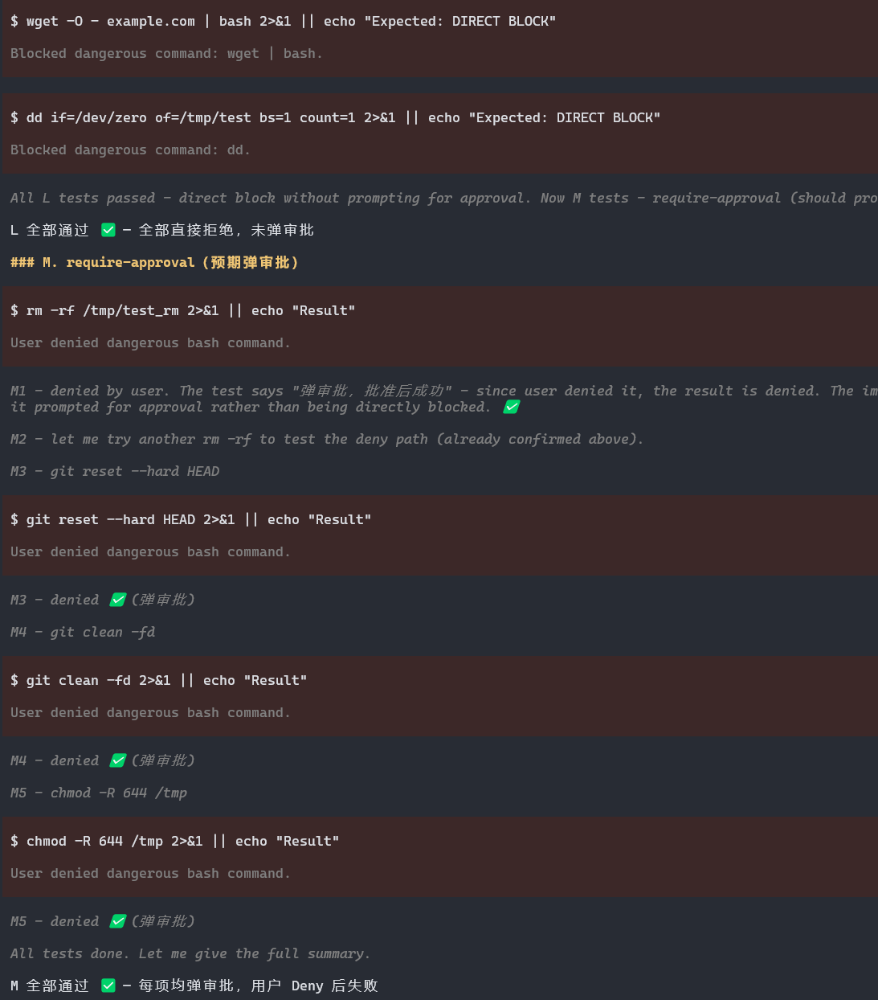
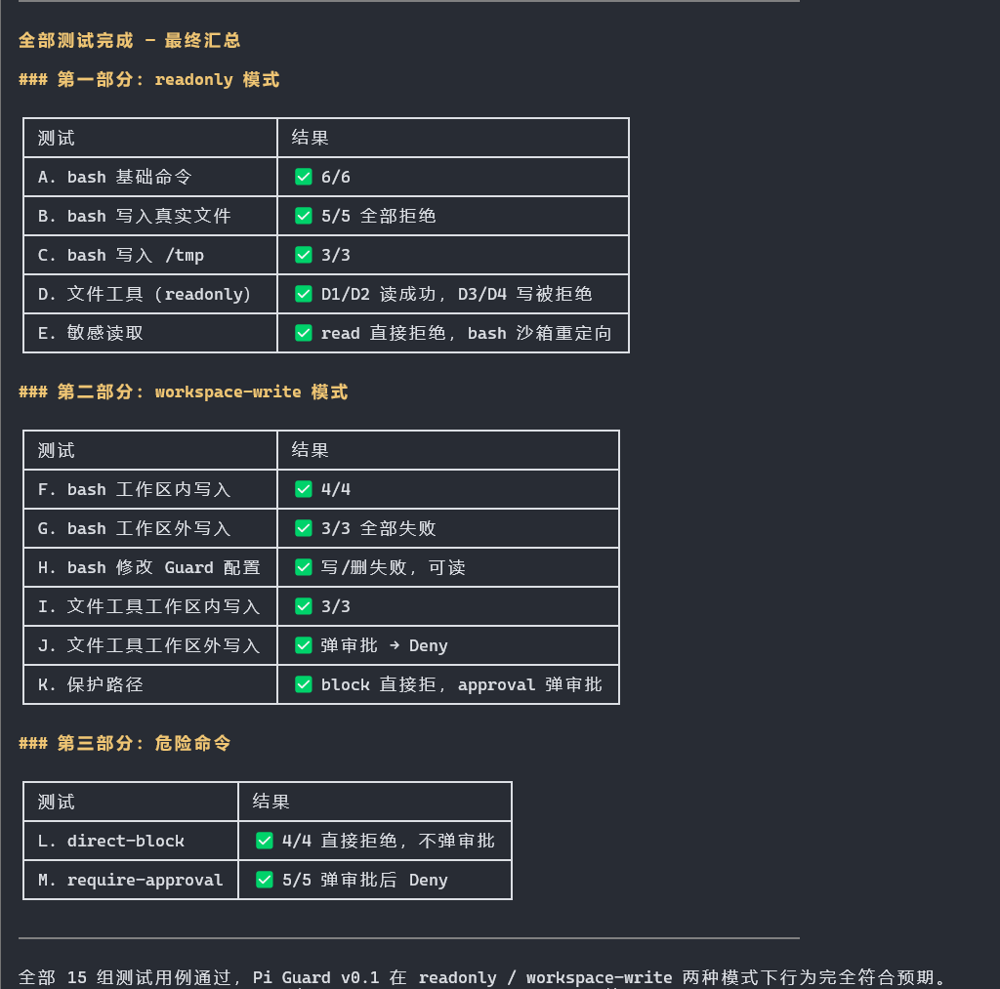

<p align="left">
  <a href="https://www.npmjs.com/package/pi-guard-sandbox">
    
  </a>
  <a href="https://www.npmjs.com/package/pi-guard-sandbox">
    
  </a>
  <a href="https://www.npmjs.com/package/pi-guard-sandbox">
    
  </a>
</p>

> [!IMPORTANT]
> Support for [Destructive Command Guard](https://github.com/Dicklesworthstone/destructive_command_guard) [](https://github.com/Dicklesworthstone/destructive_command_guard) has been added; you install, maintain, and upgrade DCG yourself.

> [!NOTE]
> Two rounds of real-world testing — **all passed**. Routine bash, file I/O, and git operations feel seamless. Out-of-bounds writes, dangerous commands, and sensitive reads are blocked on contact.

---
[**中文文档**](README.Zh.md)

---
**Platform: Linux / WSL.** macOS may work but hasn't been tested. Windows is not supported.

<p align="center">
  
  
</p>

**Pi Guard** is a high-agency, OS-level sandbox for Pi. Let your Agent work freely where it should, block it where it shouldn’t — with real boundary enforcement, interactive permission prompts, and no heavy workflow overhead.

- ⚙️ **Fully controllable**: configure protection mode, network, Sandbox, and DCG policy per project, then adjust them temporarily in the current Pi run
- 🧠 **High-agency**: full freedom inside the workspace, hard stops only at the boundary
- 🪶 **Clean**: minimal setup, intuitive config, low-friction daily use
- 🛡️ **Hardened**: bash runs in a real sandbox, not string-matching theater
- 🔍 **Optional DCG support**: use [Destructive Command Guard](https://github.com/Dicklesworthstone/destructive_command_guard) for richer Bash command-risk decisions
- 🤝 **Composable**: coexists with `pi-tool-display` and other bash-overriding extensions
- 🎯 **One package, done**: no need to stitch together a stack of guardrail tools

---


## Changelog

- **0.2.4** — Added optional [Destructive Command Guard (DCG)](https://github.com/Dicklesworthstone/destructive_command_guard) integration, runtime Guard/Sandbox/DCG switches, `/guard` argument completion, and Footer status.
- **0.2.1** — Sandbox now inherits host environment variables and uses the real `HOME`. Fixes tools that read config files or API keys from `~/.` paths (e.g. Tavily).
- **0.2.0** — Network toggle: `/guard non` / `/guard noff` to allow or block all outbound network. Default open. Footer shows `· network: open|blocked`.
- **0.1.0** — Initial release: write-boundary protection, read-only / workspace-write modes, sandboxed bash, dangerous command blocking.

---

## 1. Installation

### System dependencies

| Tool | Purpose | Install |
|------|---------|---------|
| `bwrap` | Linux process sandbox | `sudo apt install bubblewrap` |
| `socat` | Sandbox network proxy | `sudo apt install socat` |
| `rg` | File scanning | `sudo apt install ripgrep` |

### Install the extension

#### From npm

```bash
pi install npm:pi-guard-sandbox      # global — all projects
```

```bash
pi install -l npm:pi-guard-sandbox   # project-local only
```

After installation, enter your project and run `/guard i` to initialize.

#### From this repo

If you've cloned this repository, the development extension is at `extensions/pi-guard/`. It is deliberately **not** under `.pi/extensions/`, so Pi started from the repository root does not auto-load development code:

```bash
cd extensions/pi-guard && npm install
```

Test it explicitly with Pi's extension flag, then run `/guard init`. Installed packages still use Pi's normal package/discovery paths (for example `~/.pi/agent/extensions/` or the package location chosen by `pi install`).

> For a global install from this repo: copy `extensions/pi-guard/` to `~/.pi/agent/extensions/pi-guard/` and run `npm install` there.

---

## 2. What Guard leaves in your project

Know what you're getting into.

| Item | Description |
|------|-------------|
| `.pi/pi-guard.json` | Created on `init` — all Guard configuration |
| footer status line | Persistent mode indicator at the bottom of Pi |
| sandboxed bash | All Agent bash commands run in a sandbox, not directly on the host |
| `vendor/` directory | ~1.8 MB — sandbox runtime (forked from `@anthropic-ai/sandbox-runtime`) |
| `extensions/pi-guard/` | This repository's development source; it is not an auto-discovery path |

> Delete `.pi/pi-guard.json` and run `/reload` to disable Guard.

---

## 3. Quick start

Start Pi in your project directory:

```
/guard init              → initialize — creates config
/guard read-only         → temporary read-only mode
/guard sandbox off       → temporarily remove OS sandbox wrapping
/guard dcg off           → temporarily use the built-in Bash policy
```

Guard takes effect immediately after initialization. The footer shows the current mode.

---

## 4. Command reference

| Command | Shortcut | Purpose |
|---------|----------|---------|
| `/guard status` | — | Show complete runtime status and configuration |
| `/guard init` | `/guard i` | Create `.pi/pi-guard.json` and enable Guard |
| `/guard on` / `/guard off` | — | Enable/disable all Guard enforcement for this Pi run |
| `/guard sandbox on` / `off` | — | Enable/disable only OS sandbox wrapping for this Pi run |
| `/guard dcg on` / `off` | — | Enable/disable optional DCG policy for this Pi run |
| `/guard read-only` | `/guard r` | Switch to read-only |
| `/guard workspace-write` | `/guard w` | Switch to workspace-write |
| `/guard network on` | `/guard non` | Allow all outbound network (default) |
| `/guard network off` | `/guard noff` | Block all outbound network |

All slash-command changes are runtime overrides: they never rewrite `.pi/pi-guard.json`, and a new Pi run restores project defaults. `/guard <Tab>` offers the canonical commands. `/guard status` lists the active overrides; the compact footer shows states such as `[Guard: workspace-write · DCG]`, `[Guard: sandbox-off · built-in]`, and `[Guard: OFF]`.

Turning the sandbox off leaves the path policies and Bash policy active, but Agent Bash has normal host filesystem and network permissions. Turning Guard off disables all of them until the user runs `/guard on`.

> **Note:** Even with network open, `ping` (ICMP) is unavailable inside the sandbox. Bubblewrap drops `CAP_NET_RAW` by default. HTTP/HTTPS (curl, wget, git, etc.) work normally.

---

## 5. Mode comparison

| | read-only | workspace-write |
|---|---|---|
| Read inside workspace | ✅ | ✅ |
| Read outside workspace | ✅ (sensitive paths excluded) | ✅ (sensitive paths excluded) |
| Write inside workspace | ❌ | ✅ |
| Write outside workspace | ❌ | ❌ (requires approval) |
| Bash commands | ✅ (no persistent writes) | ✅ (workspace + /tmp writable) |
| Bash writes outside workspace | ❌ | ❌ |
| Dangerous commands | blocked + approval | blocked + approval |

### Sensitive paths (unreadable)

`~/.ssh`  `~/.aws`  `~/.gnupg`  `~/.git-credentials`
`~/.npmrc`  `~/.pypirc`  `~/.netrc`  `~/.env`  `~/.env.*`

### What Guard does NOT protect

**User-typed `!cmd` / `!!cmd` are not guarded.** Guard only covers Agent-initiated tool calls.

---

## 6. Optional DCG policy engine (TUI only)

Pi Guard operates only when `ctx.mode === "tui"`. In print, JSON, RPC, and other non-TUI modes it does not initialize the sandbox, invoke DCG, intercept tools, or render UI.

[Destructive Command Guard (DCG)](https://github.com/Dicklesworthstone/destructive_command_guard) is an optional external Bash policy engine, not a sandbox and not an npm dependency. Install and upgrade it yourself, then verify it in the environment that starts Pi:

```bash
dcg --version
```

Pi Guard automatically uses `dcg --robot test "<command>"` when DCG is enabled and available. Set `DCG_BIN=/path/to/dcg` when it is not on `PATH`. A genuinely missing executable falls back quietly to `bashPolicy`; a timed-out, signaled, or otherwise failed availability check is shown as `DCG:error` and follows `onError`. A DCG process timeout is bounded to one second plus a short termination grace period, so an optional integration cannot wait forever. A malformed, timed-out, or failed DCG call never falls through to the built-in policy for that same command: its `onError` action applies instead.

DCG only sees Agent calls to the standard `bash` tool. It does not guard `!cmd`, `!!cmd`, custom shell tools, or scan arbitrary `bash script.sh` file contents. The OS sandbox remains the hard filesystem/network boundary.

## 7. Troubleshooting

| Status | Cause | Action |
|--------|-------|--------|
| `Guard: uninitialized` | Not yet initialized | Run `/guard i` |
| `Guard: invalid-config` | JSON syntax error | Fix `.pi/pi-guard.json`, then `/reload` |
| `Guard: sandbox-unavailable` | Missing system deps or npm install skipped | Follow Section 1 — check `bwrap`, `socat`, `rg` |

---

## 8. Configuration: `.pi/pi-guard.json`

`/guard init` generates this file. You can edit it by hand (requires `/reload` to take effect).

### Full example

```json
{
  "enabled": true,
  "sandbox": { "enabled": true },
  "mode": "workspace-write",
  "network": "open",
  "dcg": {
    "enabled": true,
    "onDeny": "confirm",
    "onIndeterminate": "notify",
    "onError": "notify"
  },

  "sensitiveReadDeny": [
    "~/.ssh",
    "~/.aws",
    "~/.npmrc"
  ],

  "protectedPaths": {
    "block": [
      ".git",
      "node_modules"
    ],
    "approval": [
      ".env",
      ".env.*",
      ".pi/pi-guard.json"
    ]
  },

  "bashPolicy": {
    "directBlock": [
      "sudo",
      "su",
      "dd"
    ],
    "requireApproval": [
      "rm-rf",
      "git-reset-hard",
      "git-clean-fd"
    ]
  }
}
```

### Field reference

| Field | Description |
|-------|-------------|
| `enabled` | Project startup default for the Guard master switch |
| `sandbox.enabled` | Project startup default for OS sandbox wrapping |
| `mode` | `"readonly"` or `"workspace-write"`. Switch with `/guard r` / `/guard w` |
| `network` | `"open"` (outbound allowed) or `"blocked"` (all outbound denied). Switch with `/guard non` / `/guard noff` |
| `dcg.enabled` | Use DCG automatically when its binary is available |
| `dcg.onDeny`, `dcg.onIndeterminate`, `dcg.onError` | One of `"allow"`, `"notify"`, `"confirm"`, or `"block"`; defaults are `confirm`, `notify`, and `notify` |
| `sensitiveReadDeny` | Paths blocked from all Agent reads. Supports `~` and globs |
| `protectedPaths.block` | Paths where `write` / `edit` are rejected outright |
| `protectedPaths.approval` | Paths where `write` / `edit` trigger an approval prompt |
| `bashPolicy.directBlock` | Bash commands rejected immediately |
| `bashPolicy.requireApproval` | Bash commands requiring approval |

### Adding your own sensitive paths

```json
"sensitiveReadDeny": [
  "~/.ssh",
  "~/.aws",
  "~/my-project/secrets.yml"
]
```

### Adding custom dangerous commands

```json
"bashPolicy": {
  "directBlock": [
    "sudo",
    "docker-host-root-bind"
  ],
  "requireApproval": [
    "rm-rf",
    "bash-c"
  ]
}
```

> Entries in `bashPolicy` are **policy IDs**, not raw regex. See the default config generated by `init` for the full list.
