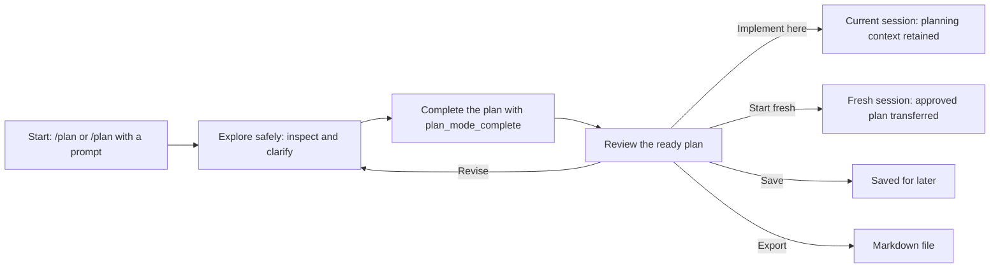
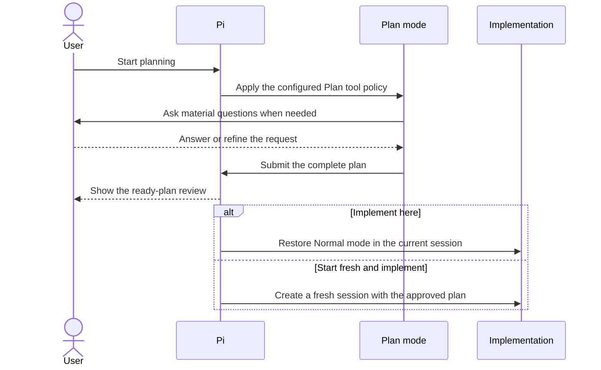

# 🧭 pi-plan-mode — Plan Before Pi Edits Code

[](https://www.npmjs.com/package/@narumitw/pi-plan-mode) [](https://pi.dev) [](./LICENSE)

Use a Codex-like `/plan` mode to explore a codebase, resolve important questions, and approve an implementation-ready plan before Pi edits files.

## ✨ Features

- Starts and manages Plan mode through `/plan`, `/plan start`, or `/plan <prompt>`.
- Blocks mutations, inactive helpers, and unsafe shell forms while keeping helper schemas stable.
- Uses structured questions for important ambiguity and explicit completion for a decision-ready plan.
- Reviews the complete plan before implementation, export, save, further planning, or discard.
- Implements in the planning session or a fresh linked session with the approved plan.
- Configures persistent or one-shot destination model and thinking choices for fresh implementation.
- Restores Plan state and one saved plan across resume and compaction.
- Configures the Plan tool allowlist, reviewed shell commands, user-trusted subcommands, export path, plan reinjection, shortcut, and thinking level.
- Publishes statusline state and cooperates anonymously with Workflow Mutex Protocol v1 participants.

## 📦 Install

This release requires Pi 0.80.6 or newer.
Native PowerShell tool support requires Pi 0.84.3 or newer on Windows; earlier Pi versions omit that optional tool and retain the existing Plan policy.

```bash
pi install npm:@narumitw/pi-plan-mode
```

Try without installing permanently:

```bash
pi -e npm:@narumitw/pi-plan-mode
```

Build and try this package locally from the repository root:

```bash
npm --workspace @narumitw/pi-plan-mode run build
pi -e ./packages/pi-plan-mode
```

The package declares `dist/index.ts`, so build an unbuilt local checkout before Pi loads the package directory.
Install only from sources you trust because Pi extensions run with Pi's permissions.

## 🚀 Quick start

Run `/plan` to open the state-aware menu, then start Plan mode and ask the agent to inspect and design the change.
Run `/plan <prompt>` when the first planning request is already known.

## 🗺️ How it works

Plan mode keeps exploration and implementation on opposite sides of an explicit review boundary:



During planning, the agent can inspect the project and ask material questions, but Plan mode blocks editing tools and unsafe shell forms. Implementation starts only after the plan is complete and you choose a handoff:



## 💬 Commands

| Command | Purpose |
| --- | --- |
| `/plan` | Start or manage planning, review a plan, or choose same-session or fresh-session implementation. |
| `/plan start` | Enter Plan mode without sending a model message. |
| `/plan <prompt>` | Start planning with a prompt, or send a follow-up while already active. |
| `/plan tools` | Choose a session-specific tool policy, then start; cancellation changes nothing. |
| `/plan show` | Display the stored plan without starting a model turn. |
| `/plan finalize` | Ask the active planner to finish or ask one remaining material question. |
| `/plan implement` | Implement a completed or saved plan in this session, without a selector. |
| `/plan save` | Save a ready plan in this Pi session and leave Plan mode. |
| `/plan settings` | Open the same Plan Settings screen available from the menus. |
| `/plan export [path]` | Write a ready, saved, or active implementation plan to Markdown. |
| `/plan exit` (alias: `off`) | Leave Plan mode and discard its ready plan, or clear a saved/active plan. |

All routes support TUI and RPC.
Print and JSON modes reject the menu, `tools`, and `settings`; stored-plan display and implementation have [additional mode restrictions](#-planning-and-implementation).
Exact subcommand words select routes; other text is a planning prompt, so `/plan start a migration` sends a prompt rather than rejecting trailing text.
There is no startup flag.

State-changing transitions require an idle run; tool selection is locked once planning starts.
`show`, `save`, `export`, and `implement` require an applicable stored plan; `finalize` requires active Plan mode.
Export defaults to the configured destination (`PLAN.md` when unset), never overwrites an existing target, and ends Plan mode only when exporting a ready plan.
See [command workflows](./docs/command-workflows.md) for tool selection, busy-state recovery, path handling, and export cancellation, and [Security and privacy](#-security-and-privacy) before allowing custom tools.

## 🔒 Security and privacy

While Plan mode is active, the policy blocks built-in editing tools and instructs the agent not to edit files or implement the change.
It should explore first and ask structured questions when a preference or tradeoff materially changes the plan.
Configure persistent defaults or a one-workflow tool override before activation; active and ready workflows lock those controls.

Plan mode registers `plan_mode_question` and `plan_mode_complete` during extension load and never changes their active status itself.
Another active-tool policy may hide them, in which case Plan start or restore fails without widening that policy.
By default, the Plan policy allows active safe built-ins such as `read`, limited `bash`, limited `powershell`, `grep`, `find`, and `ls`.
The optional native `powershell` tool must be active when an automatic Plan policy starts, for example through Pi's Windows `defaultTools` setting, unless its name was explicitly retained for first-request resolution.
Built-in `edit` and `write`, `update_plan`, tools still inactive at the first request, and deselected tools are blocked at execution time even though active schemas remain visible.
Extension and custom tools are denied by default because Pi tools do not expose standardized mutability metadata; explicitly allow a custom-tool name before starting only when you accept the risk.
For example, you can opt into `firecrawl_scrape`, `firecrawl_search`, or `lsp_diagnostics` when you want to use the effective active tool during planning.
An active selectable tool omitted from the Plan policy reports that it needs explicit selection through `/plan tools` or `defaultPlanTools` before the next workflow.
Registered but inactive, unregistered, metadata-free, and built-in blocked tools report their distinct fail-closed reasons instead of suggesting that every denial is a missing selection.
A tool admitted before later deactivation can be reactivated and reused in the current workflow without restarting.
After they become visible, the Plan-only helpers remain visible in Normal mode, but their handlers and the `tool_call` policy reject calls unless Plan mode owns the active workflow.

Limited `bash` uses a fail-closed Bash policy, including when an extension overrides the canonical `bash` tool name.
It accepts common inspection commands, read-only Git and npm queries, pipelines and command lists composed entirely of accepted commands, plus selected checks such as `npm test`, `npm run typecheck`, and `cargo test`.
It also accepts `hostname` without arguments and local Windows `tasklist` queries using reviewed display, filter, module, and service flags.
Reviewed Git inspections may place `--no-pager` before the accepted subcommand.
They may also place one or more complete `-C <path>` pairs before the accepted subcommand only when every path is `.` or the exact current Pi working directory.
Other targets are rejected so `git -C` cannot introduce executable configuration, hooks, filters, signing programs, or lazy-fetch remotes from another repository.
It rejects output/input redirects, shell expansion, substitutions, subshells, background jobs, incomplete or directory-changing `-C` pairs, other Git global options, Git config overrides, mutating flags, dependency changes, editors, and unknown commands.

Limited `powershell` uses a separate fail-closed PowerShell policy, including when an extension overrides the canonical `powershell` tool name.
It accepts canonical inspection cmdlets such as `Get-ChildItem`, `Get-Content`, `Get-Item`, `Get-Location`, `Resolve-Path`, `Select-String`, `Test-Path`, `Measure-Object`, `Sort-Object`, `Format-List`, `Format-Table`, `Out-String`, and `Write-Output`.
It accepts local `Get-Process` and `Get-Service` queries with reviewed static selectors while rejecting remote and object-input parameters.
It also accepts the same reviewed `git` and configured `gh` queries as limited Bash, including pipelines and semicolon-delimited command lists composed entirely of accepted commands.
It rejects redirects, variables, substitutions, script blocks, call operators, type or method expressions, stop-parsing tokens, multiline input, non-ASCII quotation delimiters, aliases, mutating cmdlets, and unknown commands.
Use canonical cmdlet names because PowerShell aliases are intentionally outside the reviewed policy.

A rejected parsed command list or pipeline identifies its first blocked command segment; malformed or unsupported shell syntax reports the complete submitted input instead.
Tests and builds may still write ignored caches or build artifacts and may execute project-defined hooks; enable or invoke them only when the repository is trusted.
Both limited-shell policies reduce risk but do not provide an OS sandbox or confidentiality boundary.
A configured `safeSubcommands` match bypasses both policies completely, so use it only when you intend to trust the entire submitted shell command.

## 🧭 Planning and implementation

`plan_mode_question` follows Codex's `request_user_input` pattern: the agent can ask 1-3 concise questions, each with meaningful options and a free-form Other path.
In TUI mode, a single question shows its header as plain muted text, submits as soon as its preset or custom answer is confirmed, and does not show tabs, Review, or question-navigation controls.
Add an optional note with `n` before confirming a single preset answer.
With two or three questions, one question appears at a time with question tabs and a final Review tab.
Use Tab, Shift+Tab, left, or right to visit any question or Review, including unanswered future questions.
Use up and down to choose an option, Enter to record it and advance, or `n` to record the highlighted option and open its optional note editor.
Press `n` again on an answered item to edit or clear its note.
Revisit a question to replace its answer; changing the chosen option clears its prior note.
Review lists every answer and note, blocks incomplete submission, and requires returning to a question to edit its answer or note.
Custom answers and notes retain their raw submitted text in the tool result, while terminal rendering is sanitized.
The TUI rejects either field above 4,000 characters instead of truncating it.
RPC keeps the existing sequential `select` and `editor` dialogs because Pi RPC cannot render custom TUI components.
If you cancel or no interactive UI is available, the agent should ask a concise plain-text question or proceed only with a clearly stated low-risk assumption instead of prematurely producing a final plan.

Pi identifies tools by tool name.
The pre-start selector stores accepted session policy names and shows each effective tool's source from Pi metadata, such as `built-in`, a user extension path, or a project extension path.
A selected name can run in Plan mode only when Pi has registered and activated the effective selectable tool by that workflow's first provider-bound context.
The allowlist freezes at that boundary, so a tool registered or activated later waits for the next Plan workflow.
If an extension overrides a built-in tool with the same name, Pi exposes the effective tool for that name and the selector shows that source.

A complete Plan mode answer should appear only after the agent has resolved discoverable facts and high-impact user decisions.
The agent must call `plan_mode_complete({ plan })` alone as its final action, passing the complete Markdown plan.
The tool rejects empty or whitespace-only plans and plans longer than 50,000 JavaScript characters; it does not truncate.
Its visible result contains the full plan, and versioned result details let the extension restore it safely from the active session branch.

`plan_mode_complete` uses Pi's `terminate: true` hint.
Termination is best effort: if a model puts it in a parallel tool batch, Pi terminates the batch early only when every finalized sibling tool also terminates.
The prompt therefore requires the completion call to be standalone and last.
The extension deliberately does not infer completion from phrases such as “I will present the plan,” and ordinary research or clarification turns never trigger automatic retries.
`/plan finalize` and its exact canonical finalization prompt are explicit recovery requests.
If one of those requests ends normally without a valid structured question or completed plan, Plan mode waits for `agent_settled` and retries once with stronger tool guidance.
A valid question, accepted completion, user cancellation, explicit exit, workflow supersession, reload, session replacement, or shutdown cancels the retry.
A second prose-only failure leaves Plan mode active, warns in interactive modes, and requires another explicit `/plan finalize` request.

Legacy sessions and models may still submit one non-empty `<proposed_plan>` block with tags on their own lines.
That compatibility path remains accepted, but it is not the primary workflow.
Empty, malformed, unclosed, or multiple legacy blocks keep Plan mode active and produce a warning.

After completion, `/plan` opens the ready actions when interactive UI is available.
The same flat menu shows **Implement here** and **Start fresh and implement**, explains which conversation context each choice uses, and previews the selected **Plan reinjection** policy.
**Implement here**—and the compatibility route `/plan implement`—appends the Normal contract, lifts the Plan runtime policy, captures the reinjection setting, and starts implementation in the current session with its complete planning conversation and tool calls.
**Start fresh and implement** opens a settings page before replacement.
Its searchable model list snapshots the session's scoped models when configured, otherwise Pi's currently available models, and shows each provider, model ID, and friendly name.
Pi 0.80.6–0.82.1 does not expose session model scopes to extensions, so the list uses all currently available models on those releases.
One-shot provider and model identifiers are limited to 512 characters each; longer custom identifiers are rejected before the source session is replaced.
The model and thinking rows start from the persistent **Fresh model** and **Fresh thinking** defaults; when either setting is omitted, they show the planning session's current value with **same as plan** and carry it into the fresh session independently.
The fixed thinking choices are `off`, `minimal`, `low`, `medium`, `high`, `xhigh`, and `max`.
Back navigation preserves this menu-local draft, while closing and reopening the menu restores both persistent defaults.
If the configured model is outside the current scope or no longer available, the row reports the fallback and uses **same as plan** without deleting the stored preference.
The saved-plan menu keeps its direct fresh-session action without optional rows and applies the same persistent defaults and fallback.

Starting from that settings page waits for the source session to become idle, re-resolves and authenticates an explicit model, creates a new session linked to the persisted source as its parent, and transfers the exact approved plan without copying planning messages, tool results, or compaction/branch summaries.
The destination consumes the one-shot choices before its first provider request, applies an explicit model first, and then applies explicit thinking.
Concurrent prompts that arrive while those choices are being applied are queued as follow-ups behind the kickoff prompt.
If durable consumption blocks the kickoff, the handoff reports a partial start and restores a conversation-history prompt to the editor instead of reporting success.
Changing only the model keeps the planning thinking level; changing only the thinking level keeps the planning model.
If Pi clamps an unsupported thinking level, the extension reports the effective level.
If the chosen model disappears or loses authentication after source preflight, the destination reports the race, consumes the intent without retrying it later, and continues with its default model.
The destination still loads its normal `AGENTS.md`, skills, project resources, and extensions.
Choosing **Export plan…** asks for a destination, writes the plan, appends the Normal contract, restores inherited thinking, and leaves Plan mode without starting a model turn or changing active tools.
Choosing **Save for later**—or running `/plan save`—instead stores one plan in the current Pi session before leaving Plan mode.

When a resumed active Plan workflow completes before `/plan` has run in that resumed session, the automatic menu cannot obtain Pi's command-only session replacement capability; choosing fresh asks you to reopen `/plan`, where the same action is available.
A successful fresh handoff does not delete or consume the source planning session.
Resume it later to inspect or hand off the ready/saved plan again; this deliberate duplication is the recovery path if the destination work is abandoned.
In-memory sessions create an unlinked fresh session because no parent file exists.
Escape, Ctrl+C, menu disposal, source replacement/shutdown, model/auth failure, or cancellation by another extension before replacement leaves the source plan unchanged.
Under **Off — conversation history only**, the destination receives the complete plan in its initial user prompt and does not persist active-plan state.
When a one-shot runtime choice exists, only that temporary non-model state is persisted and it is removed before the first request.
If that removal cannot be persisted, the request is not sent and can be retried after session persistence is available.
If that kickoff fails, the complete request remains in the destination editor and the source remains resumable.
Under either guaranteed-plan policy, the destination persists active-plan state before kickoff.
If guaranteed-plan persistence fails, the complete request is placed in the destination editor and the source remains resumable.
If a guaranteed-plan kickoff fails, the destination retains the active plan; send a message to continue, use `/plan exit` to clear it, or resume the parent planning session.

A saved plan appears as `plan saved` and remains available after reload, resume, branch-local fork, and compaction in that session.
It does not expire automatically, cross into a new session, or participate in ordinary model context.
Open `/plan` to Show, Implement here, Start fresh and implement, Export, open Settings, or Clear it; `/plan show`, `/plan implement`, `/plan export [path]`, and `/plan exit`/`off` retain their direct routes in TUI and RPC.
Fresh implementation checks idle state, the selected model, and authentication before session replacement; Implement here keeps its established preflight behavior.
Starting another workflow with `/plan start`, `/plan <prompt>`, or `/plan tools` is blocked until the saved plan is implemented or cleared, so the single saved slot is never silently overwritten.
Resuming that session keeps the plan saved; open `/plan` to review, implement, export, or clear it.
Cancellation or failed implementation preflight leaves it unchanged.

Text print and JSON modes cannot display the bare `/plan` menu and reject that route before changing state; use `/plan start` for direct no-prompt activation or `/plan <prompt>` to start planning with a prompt.
`/plan tools` also rejects before changing state because its staged selector requires TUI or RPC.
These modes can export any stored plan with `/plan export [path]`, save a ready plan with `/plan save`, and clear it with `/plan exit` or `/plan off`.
Successful export is observable through the created file; exporting a ready plan also leaves Plan mode, while saved and active implementation state remains unchanged.
An existing target or missing plan fails the command without changing state.
These modes reject saved-plan display and implementation before changing state because Pi provides neither printable custom-message output nor acknowledged extension-triggered turns; resume the session in TUI or RPC to show or implement it.

Both implementation paths apply the current **Plan reinjection** policy in their destination.
The default **Off — conversation history only** policy does not create active-plan state or inject a hidden plan context.
Implement here sends `Implement the plan.` and leaves the accepted plan in ordinary planning history.
Start fresh and implement, or implementing a saved plan here, puts the complete plan in one ordinary initial user prompt because no reliable planning conversation is present.
Later model calls then rely on Pi's normal conversation history and compaction behavior.
**Through first implementation run** guarantees the exact plan throughout that run, including retries, compaction retries, and queued continuation, then clears active-plan state at `agent_settled`.
**Until manually cleared** guarantees the exact plan across later turns, resume, and manual or automatic compaction until `/plan exit` or supersession.
The guaranteed policies avoid a duplicate context block while the original implementation handoff remains available and inject one hidden canonical copy after that handoff is compacted away.
Reinjection can consume up to the existing 50,000-character plan limit in model context.
Cleanup is bound to the matching implementation, so an older run settling cannot clear a newer handoff.

While a guaranteed plan is active, `/plan show` displays the accepted plan.
Interactive `/plan` offers Show, Export plan…, Settings, Start a new plan, and Clear; `/plan exit` and `/plan off` are the direct clear routes.
Settings changes never alter the policy already captured by an active guaranteed-plan implementation.
Automatic first-run cleanup removes the active status and future injected context after the triggering implementation run has received the complete plan.
Starting a new Plan-mode workflow or implementing a replacement plan supersedes an active guaranteed plan.
The extension deliberately does not infer completion from assistant prose or agent settlement under **Until manually cleared**, so clear the active plan when it no longer applies.
Under **Off — conversation history only**, implementation messages remain ordinary conversation history and there is no active plan for `/plan exit` to remove.
Choosing Stay before implementation keeps the plan ready.
Revision feedback starts another Plan-mode turn and clears the previous implementable plan until an updated completion arrives.
For clarification-only follow-ups, the agent answers and resubmits the complete unchanged plan so it remains implementable.
Before saving or implementation, exit/off discards the ready plan and removes its completion result from later non-Plan model context.

While Plan mode is enabled, the extension also publishes a compact status for Pi statuslines.
With `@narumitw/pi-statusline`, this appears in the extension status area:

- `plan active`: Plan mode is enabled and still gathering context or drafting a plan.
- `plan ready`: A completed plan is stored until you implement it, export it, save it, continue planning, or exit Plan mode.
- `plan saved`: One completed plan is stored outside model context in the current session until you implement or clear it.
- `plan implementing`: The exact accepted plan is guaranteed under **Through first implementation run** or **Until manually cleared**.

You can also exit directly.
Before implementation, direct exit discards the latest proposed plan; while a plan is saved, it clears that saved plan.
During a guaranteed-plan implementation, it removes both the original implementation handoff and the extension's canonical active-plan block from later model calls; an earlier Pi-generated compaction summary may still describe prior work:

```text
/plan exit
```

## 🧱 Cache-stable mode transitions

Plan and Normal requests share one append-only conversation.
The extension appends one hidden, model-visible, versioned Plan contract before the first Plan prompt and one Normal contract before the first post-Plan Normal or implementation prompt.
Ordinary linear turns do not rewrite or duplicate these contracts.
**Implement here** retains the Plan dialogue, structured questions, tool calls, completion evidence, and `Implement the plan.` kickoff in order.
**Start fresh and implement** is the isolation path and transfers only the approved plan plus the Normal contract to a linked session.

The `context` hook filters repeated legacy `plan-mode-context` artifacts but preserves current transition messages.
If compaction removes the effective transition, the hook inserts one canonical fallback at a deterministic retained-history boundary.
Repeated transforms leave that fallback in place instead of moving it to the newest turn.
An inactive legacy state entry does not inject a Normal contract, so sessions that never entered Plan mode keep their ordinary context after resume or reload.
Manual `/tree` navigation restores branch-owned Plan state and chooses the matching contract without navigating or adding a branch summary.
Pi lists hidden transition messages in `/tree`; Plan mode rejects those internal targets, so select an adjacent conversation entry.

Plan mode registers `plan_mode_question` and `plan_mode_complete` once and keeps their names and definitions stable across Normal, Plan, ready, implementation, and restored workflows.
Visible helpers do not mean `/plan` is active, and their descriptions exclude ordinary planning, the `writing-plans` skill, roadmaps, checklists, and plan-file work.
Only the latest active Plan contract authorizes the helpers; inactive or stale calls fail without accepting a plan or opening question UI.
Plan mode does not widen a restrictive active-tool policy; start or restore fails when a required helper is unavailable.
Stable schemas preserve a cache-eligible prefix but cannot guarantee a hit because provider serialization, cache lifetime, minimum prefix size, implementation details, and session affinity remain external.

The default `thinkingLevel: "inherit"` avoids a Plan-specific reasoning-parameter change.
A fixed Plan thinking level remains supported, but changing reasoning parameters can prevent provider-side state reuse even when prompts and tool schemas stay stable.

## 🤝 Workflow coexistence

Plan mode is independently installable and keeps its standalone behavior when no other protocol participant is present.
On the characterized Pi `0.84.2` runtime, it participates in the anonymous `workflow:mutex:v1` `agent-workflow` group.
It holds the group while Planning is active, while a completed plan awaits review, and while revision is underway.
Saved plans and ordinary implementation after Plan handoff do not hold the group.

Every inactive start performs one final synchronous admission after asynchronous preflight and before changing Plan state, persistence, prompts, tools, thinking level, queues, or status.
If another participant is active, TUI and RPC show an anonymous warning that another workflow is active.
Print and JSON direct routes throw the same anonymous error before mutation.

Launch-menu, selected-tool, shortcut, active-implementation **Start a new plan**, and restored activation use the same admission boundary.
A rejected selected-tool launch does not save its draft choices.

Restored active Plan state acquires before restoring restrictive tools, thinking, status, or model hooks.
If restoration is busy, Plan mode stays non-running, leaves persisted history and active tools untouched, and requires a later reload or explicit new start after the other workflow ends.
Planning-session cancellation during a fresh implementation preflight keeps the source Plan and its ownership.
Successful session replacement relies on source-session shutdown to clean up and release; the destination's ordinary active implementation does not acquire the Plan mutex.

The coexistence guarantee is cooperative and applies only when every contender implements v1 on the characterized Pi runtime and shares its event bus and session-manager identity.
A pre-v1, mixed-version, non-participating, forked, or otherwise uncharacterized counterpart remains unsupported for mutual exclusion.
Plan mode does not identify, inspect, configure, start, stop, or depend on another extension.
Guaranteed coexistence with Goal requires `@narumitw/pi-goal` `0.53.0` or newer and this package at `0.52.0` or newer on the characterized Pi `0.84.2` runtime.

| Installation | Support |
| --- | --- |
| Plan mode without another workflow participant | Supported standalone behavior |
| Plan mode `>=0.52.0` with Goal `>=0.53.0` on Pi `0.84.2` | Workflow Mutex v1 coexistence guarantee |
| Either package below its floor, or another Pi runtime | Standalone behavior only; mutual exclusion unsupported |

## 🛠️ Tools

- `plan_mode_question` asks up to three structured questions, supports optional answer notes, submits one answer directly, and reviews multiple answers before TUI submission.
- `plan_mode_complete` records the complete approved Markdown plan and terminates the planning turn when called alone.

## ⚙️ Settings

Run `/plan settings`, open **Settings** from an inactive `/plan` menu, or edit `<getAgentDir()>/pi-plan-mode.json` (normally `~/.pi/agent/pi-plan-mode.json`).
The optional file is read at session start and watched for changes; only an explicit save creates it.

```json
{
  "thinkingLevel": "inherit",
  "implementationPlanRetention": "clear-on-start",
  "defaultImplementationModel": {
    "provider": "anthropic",
    "modelId": "claude-sonnet-4-5"
  },
  "defaultImplementationThinkingLevel": "high",
  "defaultPlanExportPath": "PLAN.md"
}
```

By default, Plan mode inherits thinking, allows active safe built-ins, uses the planning model and thinking level for fresh implementation, exports to `PLAN.md`, and relies on ordinary conversation history after implementation starts.
The shortcut is disabled unless configured; enabling, changing, or removing it takes effect after `/reload` or restarting Pi.
Until then, the current shortcut binding stays unchanged.
Settings saves apply to later workflows; an active implementation keeps its captured reinjection policy.
The export destination affects the next export immediately.

> [!WARNING]
> `safeSubcommands` is a JSON-only full-command trust override, not a read-only allowlist.
> A matching prefix bypasses all shell checks, including checks on trailing commands, redirects, and mutations.
> Configure it only for commands and repositories you fully trust.

Saves are ordered within one Pi process, preserve unknown fields, and publish atomically; separate Pi processes can still race.
Invalid settings remain untouched and make Settings read-only; session-start failures use safe defaults.

Read the [settings reference](./docs/settings.md) for all accepted values, tool-policy resolution, reinjection choices, shortcut configuration, shell-override examples, and legacy-file migration.

## 🧠 Codex-like behavior

This extension maps Codex's `ModeKind::Plan` behavior onto Pi's extension API:

- Plan mode is conversational collaboration, not TODO or progress tracking.
- `/plan <prompt>` enters Plan mode before submitting the prompt.
- The agent uses `plan_mode_question` for material preferences and completes with a standalone `plan_mode_complete` call instead of prose detection.
- `update_plan` is blocked until the explicit implementation boundary restores Normal mode.
- The default `clear-on-start` policy uses conversation history; `clear-after-first-run` and `keep` add exact-plan guarantees.
- Append-only Plan and Normal contracts keep helper schemas stable, but Pi's tool policy is risk reduction rather than Codex sandbox enforcement.

## 🗂️ Package layout

```text
packages/pi-plan-mode/
├── src/                               # Policy, questions, settings, and handoff modules
│   ├── index.ts                       # Thin Pi entrypoint
│   └── plan-mode.ts                   # Planning policy and implementation handoff
├── dist/                              # Generated Jiti runtime
├── scripts/build-runtime.mjs          # Runtime builder
├── docs/                              # Published reference documentation
└── test/                              # Behavior and lifecycle coverage
```

The generated runtime is built from `src/index.ts` and does not import back into `src`.

## 🔎 Keywords

Pi extension, Pi coding agent, plan mode, Codex-like plan mode, AI coding workflow, read-only planning, implementation plan.

## 📄 License

MIT.
See [`LICENSE`](./LICENSE).
