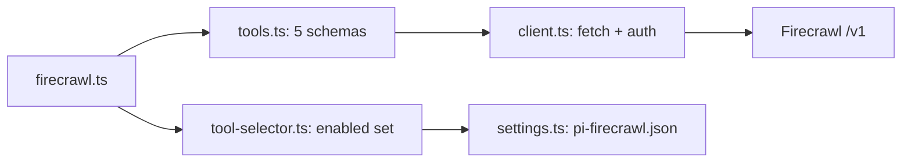

# pi-firecrawl：把远端 Web 抓取能力包装成 Pi tools

## 主线

`session_start` 读取已选工具 → 注册的五个工具仍在 Pi 中可见，但由 selection 控制启用 → 模型调用某 tool → `cleanObject` 去掉 `undefined` → `firecrawlRequest` 加 Bearer key 并请求 Firecrawl → JSON/文本错误规范化 → `withStatus` 期间显示 `firecrawl: <action>`，最终清除。

这是最适合从零模仿的“薄适配器”扩展：业务语义在 API，扩展只定义清晰 schema、认证边界、状态反馈和设置恢复。

## 架构

## 源码地图

| 文件（行） | 定位与逐段职责 | 关键函数/阅读重点 |
| --- | --- | --- |
| `src/index.ts:1` | 仅把包发现入口转发到实现；不要把逻辑放这里。 | `default` |
| `src/firecrawl.ts:1-53` | 引入边界、命令常量和 `firecrawl(pi)`；注册五 tools、`/firecrawl`、启动/关闭事件。 | `firecrawl` 是 composition root。 |
| `src/firecrawl.ts:89-146` | 解析命令并把每个动作路由至通知、选择器或批量启停；无 UI 时降级为文本。 | `handleFirecrawlCommand`、`showMenu` |
| `src/firecrawl.ts:148-173` | 将别名折叠为有限 `CommandAction`，提供补全；最后重导出可测试的纯边界。 | `parseCommand`、`commandCompletions` |
| `src/tools.ts:1-186` | `FIRECRAWL_TOOL_NAMES` 是单一事实来源；五个 `defineTool` 逐项把 TypeBox 参数映射到 API path。execute 都遵守“状态包裹 → 清理 payload → 请求 → Pi result”。 | `scrapeTool` `/scrape`；`crawlTool` `/crawl`；`crawlStatusTool` `/crawl/:id`；`mapTool`；`searchTool` |
| `src/client.ts:1-99` | 外部 I/O 的唯一入口：启动时缓存 base URL；请求时取 key；失败带 HTTP status 与 body；UI 状态用 `finally` 清除。 | `firecrawlRequest`、`getApiKey`、`parseResponseBody`、`withStatus`、递归 `cleanObject` |
| `src/settings.ts:1-188` | 读取新文件优先、迁移旧文件、验证 tools 白名单；临时文件 + hard-link 防止覆盖竞争。 | `loadSettings`、`installSettingsFileExclusively`、`normalizeFirecrawlSettings`、`saveSettings` |
| `src/tool-selector.ts:1-330` | 将“持久化选择”与“当前 Pi activeTools”同步；同时提供 TUI selector 和文本状态。 | `showToolSelector`、`applyFirecrawlTools`、`updateFirecrawlTools` |
| `test/firecrawl.test.ts` | 命令解析、HTTP 参数、设置迁移和工具选择的回归合同。 | 先读失败 case，再读实现。 |

## 从零实现同类扩展

先只做一个 `defineTool({ name, parameters: Type.Object(...), execute })`，让 `execute` 调一个单独的 `request()`。确认模型能调用后，再添加 status 包装；最后才做 selector/迁移。常见错误是把环境变量检查放进 `session_start`：这会让未配置 API 的普通启动失败。这里把 `FIRECRAWL_API_KEY` 延迟到实际请求时检查，`config/status` 仍可正常使用。

## 可迁移的原则

- schema 是给模型的 API 文档；字段描述比“万能 `Any`”更能避免错误调用。
- 设置“无文件”不是错误，损坏文件才是可见 warning；不能因配置失败改变 Pi 原有工具策略。
- `withStatus` 的 `finally` 是必要的用户体验逻辑：网络错误和 abort 不能留下假运行状态。
