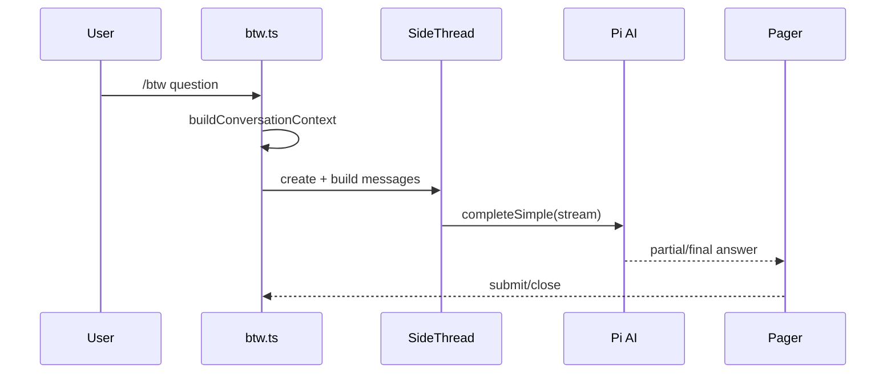

# pi-btw：临时侧线程，而非主会话的另一条消息

## 主线

`/btw <question?>` 截取当前 session 的可见分支作为只读背景，创建内存 `SideThread`。每次提问将第一轮背景 prompt 与后续简短 prompt 组装成独立消息数组，调用 Pi AI 的 `completeSimple` 流式生成；TUI pager 显示转录并允许继续提问。关闭、切 session、reload 都丢弃线程，绝不写回主会话。

## 架构与状态

| 文件（行） | 定位与逐段职责 | 关键函数/状态 |
| --- | --- | --- |
| `src/index.ts:1` | 包入口转发。 | `default` |
| `src/btw.ts:1-203` | 定义 settings、模型解析和读取；模型配置可失败回落到当前 session model，thinking level 可继承。 | `normalizeBtwSettings`、`parseBtwModelReference`、`resolveBtwModel`、`readBtwSettings` |
| `src/btw.ts:204-376` | 注册 `/btw`，对一次 side thread 进行“取设置 → 取模型 → 打开 pager → 问答循环”的编排。 | `btw`、`runBtwThread`、`askThreadQuestion`、`showThreadComposer` |
| `src/btw.ts:378-462` | 将主 session entries 压为安全、长度受限的背景文本；防止多行输入污染命令。 | `sanitizeSingleLine`、`buildConversationContext`、`extractContentLines`、`truncateFromStart` |
| `src/side-thread.ts:1-82` | 定义 thinking levels、认证和 thread/turn 数据模型。 | `SideThread`、`SideThreadTurn` |
| `src/side-thread.ts:83-157` | 首轮含上下文，后续只含 follow-up；把 streaming partial update 转成可供视图消费的 turn。 | `createSideThread`、`buildSideThreadMessages`、`completeSideThreadTurn` |
| `src/side-thread.ts:167-247` | 兼容单问答调用、提取 assistant 文本、构造两类 prompt 和 stream options。 | `completeSideQuestion`、`buildUserPrompt`、`buildFollowUpPrompt` |
| `src/transcript-pager.ts:28-171` | `BtwTranscriptPager` 是可输入、可滚动组件；处理 Enter/PgUp/PgDn/Ctrl+C 并向控制器发 `submit/close`。 | `render`、`handleInput` |
| `src/transcript-pager.ts:173-378` | `BtwAnsweringView` 在生成时保留转录并显示状态；底部工具函数处理宽度、终端控制字符和布局预算。 | `finish`、`dispose`、`formatSideTranscript` |
| `test/btw.test.ts`、`test/side-thread.test.ts` | 固定模型回退、prompt 边界、历史拼接和 UI 无关的完成逻辑。 | 测试是隔离主会话的证据。 |

## 从零开发要点

先写纯的 `buildMessages(thread, question)` 并测试“首轮有背景、后续无重复背景”；再接 API；最后做 TUI。核心边界是**背景可以读、主 session 不能写**。如果把 side question 通过普通 `pi.sendUserMessage` 发送，产品保证就立刻失效。

## 逐行抓手

看到 `readonly`/`type` 行时，检查它是否禁止线程外部突变；看到 `AbortSignal`，沿调用链确认 Ctrl+C 能到 API；看到 pager 的 `invalidate`，确认状态变更只触发重绘而不重新发请求。
