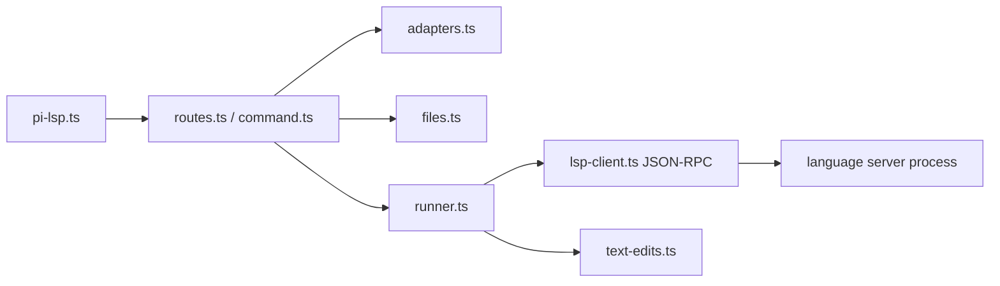

# pi-lsp：把 Language Server Protocol 变成可验证的 agent 工作流

## 主线

`/lsp` 或工具请求先解析 workspace root、配置与适配器，再安全收集受支持文件。runner 为每种 server 启动 `LspClient`，初始化 JSON-RPC 会话，对文件 `didOpen`，等待 diagnostics 稳定；修复时获取 code actions、解析 workspace edits 并以受控写入落盘，最后 shutdown。它不是“运行 linter”的壳，而是完整的 LSP 生命周期适配器。

| 文件（行） | 定位与逐段职责 | 关键函数/概念 |
| --- | --- | --- |
| `src/pi-lsp.ts:1-206` | 入口注册命令/工具，组合 routes、配置、runner；仅负责宿主胶水。 | 默认 initializer、tool execute |
| `src/command.ts:1-149` | slash command 的有限语法、补全和面向用户的错误文本。 | command parser/handler |
| `src/routes.ts:1-127` | 把诊断、修复、服务器信息等用户意图路由到 runner；保持 command 层不知晓 JSON-RPC 细节。 | route dispatch |
| `src/adapters.ts:1-613` | 内置/用户 LSP 配置的规范化中心：语言扩展名、命令、参数、env、workspace、timeout、配置文件读取。 | `loadAdapters`、`normalizeConfig`、`configToAdapter`、`languageIdFor` |
| `src/files.ts:7-119` | root/path 必须留在 workspace；递归收集有上限、去重并处理 realpath，避免扫出项目。 | `resolveRoot`、`resolveSupportedFile`、`collectSupportedFiles` |
| `src/lsp-client.ts:15-457` | stdio JSON-RPC 客户端：spawn、`initialize`、request/notify、diagnostics 等待、超时与 shutdown。 | `resolveSpawnCommand`、`LspClient.start/initialize/didOpen/diagnostics/codeActions/shutdown` |
| `src/runner.ts:1-223` | 一次诊断/修复的事务编排；确保 client 在错误时也被关闭，合并每个 server 的结果。 | runner public operations、client lifetime |
| `src/text-edits.ts:1-96` | 把 LSP 的 range/text edit 转为实际文件内容；检测重叠/非法位置，防止盲写。 | text edit application helpers |
| `src/types.ts:1-102` | 仅放 LSP/Pi 边界的数据形状，减少 `any` 泄漏。 | protocol types |
| `test/lsp-client.test.ts`、`test/lsp.test.ts` | fixture server 验证 framing、初始化、诊断稳定与修复结果。 | 先读 timeout/cleanup case。 |

## 从零开发

第一个版本只支持一个 server、一个文件和 diagnostics：实现 Content-Length framing、request id 与 `publishDiagnostics` 监听。然后才加入 adapter 配置、多文件和 code action。任何 `spawn`/文件路径都要当作不可信输入：命令必须来自受控配置，用户路径必须通过 `resolveWorkspacePath`。

## 读到每行时要验证的协议不变量

- request 有 id，response 一定解析到同一个 pending promise；notification 没有 id，绝不可等待 response。
- `didOpen` 使用的 URI、语言 id、文本必须是同一文件版本。
- edit 的 line/character 是 LSP 坐标，不是 JS 字符串 offset；转换函数是正确性的核心。
- `finally` 中 shutdown/close 能在 server 崩溃和用户取消时执行。
