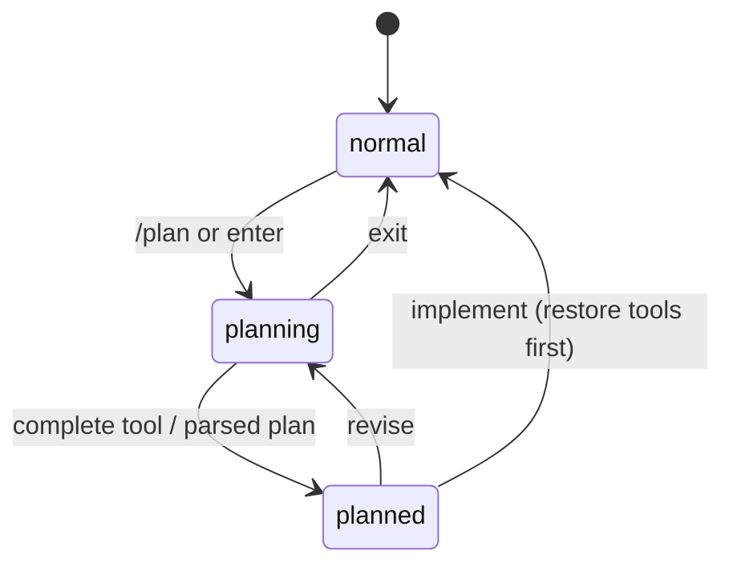

# pi-plan-mode：用状态机约束“先计划、后执行”

## 主线

进入 `/plan` 后，扩展快照原工具集和 thinking level，选择只读安全工具，加上 `plan_mode_question` 与 `plan_mode_complete`。agent settled 时从输出中提取/保存计划；用户在 selector 中继续、编辑选择或开始实现。开始实现时先恢复工具/思考等级，再发实施 prompt；退出则丢弃计划。核心不是 UI，而是**每条状态转移都可恢复且失败关闭**。

| 文件（行） | 定位与逐段职责 | 关键函数/不变量 |
| --- | --- | --- |
| `src/plan-mode.ts:1-990` | 主控制器：注册 command/tools/events，维护 UI、持久化、进入/退出/实施/选择器流程。 | `enterPlanMode`、`exitPlanMode`、`startImplementation`、`applyPlanModeTools`、`restoreTools`、`completePlanArguments` |
| `src/state.ts:1-128` | plan state 序列化与恢复；区分原始工具、选中工具、手工 thinking 和已完成计划。 | state schema/normalization |
| `src/tool-policy.ts:1-596` | 最关键安全模块：分类 builtin、解析 bash 命令、按 shell segment 拒绝 expansion/写操作，仅允许受审计的只读子命令及参数。 | `classifyPlanModeTool`、`isSafeCommand`、`splitShellSegments`、Git/GH validators |
| `src/question-tool.ts:1-207` | 计划期向用户收集不可推断偏好的终止工具；验证问题与选项。 | question tool |
| `src/completion-tool.ts:1-70` | agent 显式提交一个计划，避免依赖脆弱的自然语言“看起来完成”。 | completion tool |
| `src/message-transform.ts:1-167`、`src/prompt.ts:1-59` | 注入计划提示、提取 fenced/legacy plan，并构造实施消息。 | parser/transform |
| `src/settings.ts:1-257` | 新旧 JSON 迁移、safe tool 默认值、固定 thinking 可选覆盖。 | settings normalize/load |
| `src/selector-ui.ts:1-95`、`src/subagent-policy.ts:1-98` | 工具选择器与对 subagent 的显式 allowlist 规则。 | UI/policy |
| `test/*.test.ts` | shell 攻击面、状态恢复、默认工具、问题工具、issue 回归。 | 这是安全规格。 |

## 从零实现建议

先定义状态枚举和 transition table，再写注册 API。最小版只需：enter 时保存 `previousTools`，set active tools，exit 时恢复。随后加 completion tool 和 persistence。不要用“检测文本里含 plan”作为唯一结束条件；显式 tool call 提供可测试的边界。

## 审计每一行的角度

看到 shell parser 就问：分号、管道、重定向、`$()`、glob 与 option abbreviation 是否都覆盖？看到恢复代码就问：若用户在 planning 中手动改 thinking，退出是否错误覆盖？看到 unknown tool 就问：是否 fail-closed？这里的答案应始终偏向拒绝而非猜测安全。
