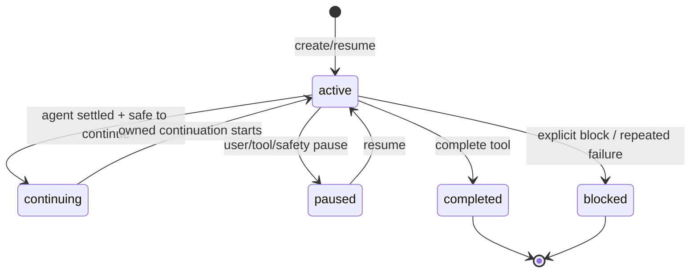

# pi-goal：可持久化的目标状态机与自动续跑引擎

## 主线

用户创建目标后，扩展创建带 UUID、生命周期时间与可选 token budget 的 `ActiveGoal`，把“目标提示”作为可识别的系统拥有消息送入 Pi。每轮结束，runtime 检查输出、工具可用性、预算、上下文溢出、重复无工具输出和用户打断；满足条件就排队下一轮 continuation。目标完成/阻塞/暂停时，清理计时器和 stale call、防止旧轮继续写状态，并把规范状态持久化进 session。

这是八个项目中最强的状态机范例：控制流分散在 tool、command、session event、agent event 和定时任务，所有分支最终必须收敛到同一份 runtime state。

| 文件（行） | 定位与逐段职责 | 关键函数/阅读重点 |
| --- | --- | --- |
| `src/goal.ts:1-1127` | 根控制器和事件编排；注册 `create_goal`/`update_goal`、命令、session/agent 监听器、continuation 与 recovery。 | `registerGoalRuntime`、tool `execute`、continuation/cleanup helpers |
| `src/runtime.ts:1-1109` | `GoalRuntime` 的状态、计时器、当前目标、恢复标记、统计与状态展示的操作集合。 | runtime mutations；先找所有 `clear*` 和 `request*` 调用 |
| `src/commands.ts:1-625` | `/goal` 的 start/add/prioritize/drop/skip/pause/resume/edit/show；队列动作仅在 agent settled 后派发。 | `GoalCommandController`、`dispatchPendingQueueActionIfSettled` |
| `src/command.ts:1-196` | 命令语法、补全、数字预算解析与错误消息。 | parser/completions |
| `src/queue.ts:1-99` | 纯队列变换：append、prioritize、drop、skip、shelve、activate。 | `createQueuedGoal`、`prioritizeGoal`、`activateQueuedGoal` |
| `src/persistence.ts:1-318` | session state 序列化/规范化、legacy state 兼容；不信任读回的数据。 | `serializeGoalState`、`loadGoalStateFromSession`、`normalizeLoadedGoal` |
| `src/accounting.ts:1-108` | 时间/tokens/cost 的累积和 checkpoint，避免重复计量。 | accounting helpers |
| `src/safety.ts:1-78` | 无工具重复输出指纹、safety epoch/reset；用以停止无进展自动循环。 | `nextToolFreeRepeatState`、`fingerprintVisibleAssistantOutput` |
| `src/errors.ts:1-147` | 把 Pi assistant 结束原因标准化，识别 usage limit、retryable 与 context overflow。 | `isRetryableGoalInterruption`、`findFinalAssistantMessage` |
| `src/markers.ts:1-25`、`src/prompts.ts:1-105` | 注入/识别扩展拥有的 prompt marker，构造 create/resume/continuation 文本。 | marker extraction/build prompt |
| `src/rpc.ts:1-188`、`src/settings.ts:1-188` | RPC/非 TUI 兼容与设置读取。 | boundary adapters |
| `test/goal*.test.ts`、`test/queue.test.ts`、`test/persistence.test.ts` | 状态转换、恢复、队列与预算的行为合同。 | 先看 interrupted/reload tests。 |

## 从零开发路线

1. 只建 `Goal` type 与 `create → complete` 两个 tool，并在 session state 保存/恢复。
2. 抽出纯 transition（输入旧 goal + event，返回新 goal）；为每个终态写测试。
3. 加命令和队列，但让队列 activation 只走一个函数。
4. 最后加入自动 continuation、预算和 safety guard；每加一种定时/异步工作，都必须有取消句柄和 ownership marker。

## 不变量与常见陷阱

- 终态不可复活；每个终态分支都清理 continuation/recovery/status。
- 旧 agent 回调不能改新目标：比较 goal id/instance 或 marker。
- token budget 是会计问题，不是 UI 提示；更新要有 checkpoint 且排除重复读取。
- “模型没调用工具又输出相同内容”应被视为潜在循环，而非无限续跑信号。
