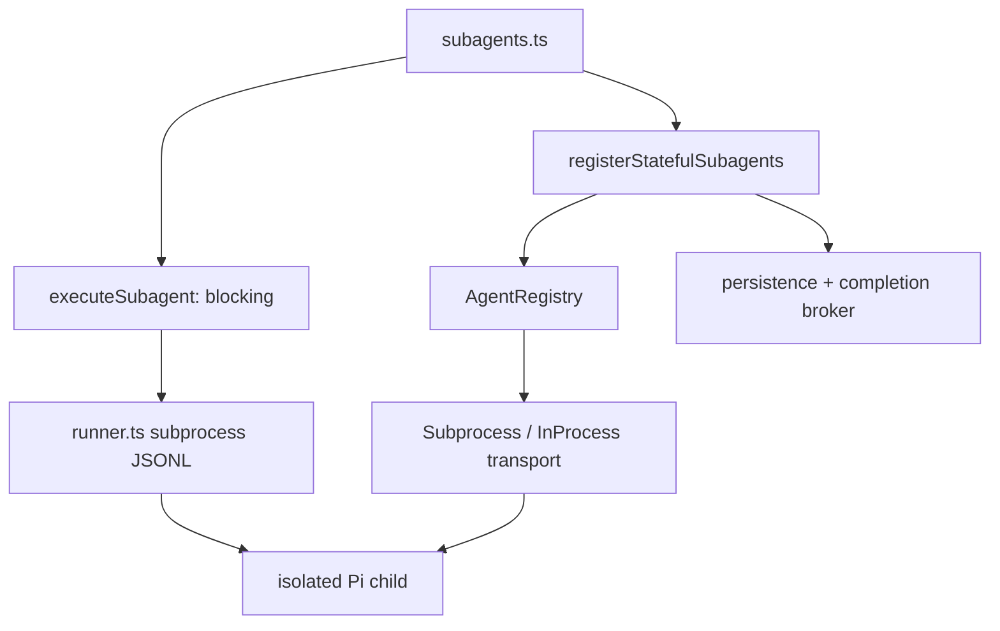

# pi-subagents：批量编排 + 可寻址常驻代理的双运行时

## 主线

该包同时提供阻塞 `subagent` 和 detached lifecycle tools。前者选择 single/parallel/chain 三种互斥模式，发现 agent 配置后启动隔离 `pi --mode json -p --no-session` 子进程，流式解析 JSON Lines、限制输出并可 fan-in 汇总。后者把 `ManagedAgent` 放入 registry：有树结构、并发队列、mailbox、持久化、workspace 和 transport 抽象；completion broker 决定下个 root turn 或自动恢复时如何投递。

| 文件（行） | 定位与逐段职责 | 关键函数/类 |
| --- | --- | --- |
| `src/subagents.ts:1-95` | composition root：注册 blocking tool、render hooks、settings notice、stateful tools 和 `/subagents` 配置。 | default initializer |
| `src/params.ts:1-61`、`src/stateful-tool-params.ts:1-202` | TypeBox/运行时参数形状和严格 action 验证；保持 tool surface 明确。 | validators |
| `src/execution.ts:1-480` | blocking 模式调度：深度 guard、agent discovery、project agent 信任确认、chain/parallel/fan-in、聚合状态。 | `executeSubagent`、`assertSubagentDepthAllowed`、`parsePositiveInteger` |
| `src/runner.ts:1-704` | 一个子进程的底层协议：构造 CLI args、临时 prompt 文件、读取 JSONL、限制 bytes、stream update、timeout/abort/process group 终止。 | `runSingleAgent`、`buildPiArgs`、`mapWithConcurrencyLimit`、`terminateProcess`、`buildFanInContext` |
| `src/agents.ts:1-280`、`src/settings.ts:1-413` | 内置/用户/project agent 发现、frontmatter 规范化、模型/工具/思考等级/配置持久化。 | `discoverAgents`、settings normalize/resolve |
| `src/registry.ts:1-777` | detached 代理的核心状态机：容量、父子深度、queue、AbortController、history/mailbox、过期与恢复。 | `AgentRegistry.restore/spawn/run/followUp/manage/mailbox` |
| `src/stateful.ts:1-968` | 注册 stateful lifecycle tools，选 transport，处理共享写冲突、context snapshot、completion delivery 与状态展示。 | `registerStatefulSubagents`、`CompletionDeliveryBroker`、`assertNoSharedWriteConflict` |
| `src/in-process-transport.ts:1-668`、`src/subprocess-transport.ts:1-51`、`src/transport.ts:1-30` | 把“如何执行一轮”从 registry 抽离：SDK child session 与 subprocess 两种实现可替换。 | `SubagentTransport`、`FunctionTransport` |
| `src/context.ts:1-129`、`src/limits.ts:1-62` | 上下文快照/脱敏与 UTF-8 byte 截断；token 之前先控制字节边界。 | `buildContextSnapshot`、`truncateUtf8` |
| `src/persistence.ts:1-210`、`src/workspace.ts:1-116` | stateful records 的落盘/恢复；为隔离工作创建、清理 worktree/workspace。 | `AgentPersistence`、`WorkspaceManager` |
| `src/render.ts:1-645`、`src/config-ui.ts:1-654` | 大结果的紧凑/展开渲染和当前 session-first 的配置界面。 | renderers/config controller |
| `test/*.test.ts` | 协议、registry、编排、completion delivery、in-process transport 的回归规格。 | 并发和 abort case 最重要。 |

## 从零开发路线

先做 blocking single：安全发现一个 agent → `spawn` Pi 子进程 → 解析最终 assistant text。之后再做 parallel，且为最大并发、timeout、abort 写测试。只有当需要 follow-up/history/mailbox 时，才引入 `AgentRegistry`；不要在 blocking 工具上堆“常驻”状态。

## 关键不变量

- 输入必须恰好选择 single、tasks 或 chain 之一；fan-in 只能附着 parallel tasks。
- project-local agent 是仓库控制代码：必须 trusted project + 默认确认。
- registry 的每个运行代理有一个 AbortController；关闭、超时、取消都要收敛为一次状态更新。
- 同 cwd 的并发写能力代理是冲突，不是“并行加速”；`assertNoSharedWriteConflict` 必须在启动前执行。
- 所有跨边界文本按 UTF-8 bytes 截断，避免 JSONL、prompt、mailbox 和 UI 各自无限增长。
