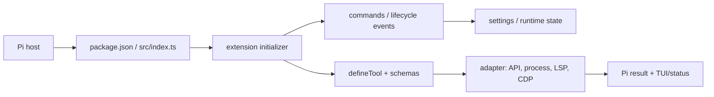

# Pi extensions：源码项目解析索引

这组包不是一个 monorepo 运行时：每个 `pi-*` 文件夹都是可单独发布、由 `package.json → pi.extensions → src/index.ts` 装载的 ESM Pi 扩展。`index.ts` 都只有一行转发；真正入口是各包的同名文件。本文档把源码按**行为边界**而非按字面逐行复述：每张“源码地图”的行段都是读代码时的定位单位；段内的空行、类型、常量、守卫和语句共同完成表中所述职责。

## 先建立共同心智模型

从零做一个新扩展，沿着这个闭环实现即可：

1. `package.json` 设置 `type: module` 与 `pi.extensions: ["./src/index.ts"]`，将宿主发现机制和实际入口解耦。
2. `src/index.ts` 仅重导出默认初始化函数；在 `feature.ts` 中接收 `ExtensionAPI`，注册 tool、command、生命周期监听器。
3. 给每个 tool 定义 TypeBox 参数、可供模型选择的描述、`execute`、必要时 `renderCall/renderResult`；永远让可变状态在 `finally` 里复位。
4. 把 I/O 放到 adapter/client：命令处理与 UI 不直接拼 HTTP、控制子进程或写文件。
5. 设置读取必须容忍缺失、损坏和旧文件；写入用临时文件/硬链接/rename 等原子策略；所有外部输入先验证。
6. 用单元测试固定纯函数、状态转换和失败路径；再用宿主事件把模块接起来。

## 项目阅读顺序

| 扩展 | 解决的问题 | 先读 | 解析 |
| --- | --- | --- | --- |
| `pi-firecrawl` | 将 Web API 变成五个工具 | `firecrawl.ts → tools.ts → client.ts` | [01](./01-pi-firecrawl.md) |
| `pi-btw` | 不污染主对话的侧边问答 | `btw.ts → side-thread.ts → transcript-pager.ts` | [02](./02-pi-btw.md) |
| `pi-chrome-devtools` | CDP 浏览器自动化和安全截图 | `chrome-devtools.ts → tools.ts → cdp-client.ts` | [03](./03-pi-chrome-devtools.md) |
| `pi-lsp` | 将语言服务器诊断/修复接入 agent | `pi-lsp.ts → runner.ts → lsp-client.ts` | [04](./04-pi-lsp.md) |
| `pi-statusline` | 生命周期驱动的 TUI 页脚 | `statusline.ts → render.ts → settings.ts` | [05](./05-pi-statusline.md) |
| `pi-plan-mode` | 受限工具集下的规划状态机 | `plan-mode.ts → state.ts → tool-policy.ts` | [06](./06-pi-plan-mode.md) |
| `pi-goal` | 可持久化、可恢复的目标执行循环 | `goal.ts → runtime.ts → commands.ts` | [07](./07-pi-goal.md) |
| `pi-subagents` | 同步和异步子代理编排 | `subagents.ts → execution.ts → runner.ts → stateful.ts` | [08](./08-pi-subagents.md) |

## 如何做到“逐行看懂”

不要机械地给 22k 行重复加注释。用以下四问阅读每个表中的行段，能解释段内每一行的存在理由：它输入什么、维护/转换什么状态、产生何种副作用、失败后怎样恢复。类型/常量行回答“允许什么”，校验行回答“拒绝什么”，`try/finally` 回答“如何收尾”，导出行回答“谁可以依赖它”。文档中的“关键函数”列列出公开边界和会改变控制流的私有函数；短小的 `format/isRecord/unique` 辅助函数则紧邻其调用点阅读。

所有解析以当前工作区源码为准；测试目录是行为合同，而不是附录。修改任一模块后，应先定位其对应测试，再运行该包的 `npm run check`。

完整的具名函数、方法、类和箭头函数定义行见[全量符号定位索引](./FUNCTION_LOCATOR.md)；它由 TypeScript AST 提取，避免手写索引漏项。
