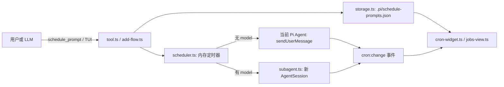

# `pi-schedule-prompt` 项目深度解析

> 阅读目标：理解它为什么能“让 Agent 自己安排未来的提示词”，能沿着一次任务的完整生命周期追踪代码，并能从零搭出同类型 Pi 扩展。本文以源码行号为索引；每个可执行函数/类方法都给出职责与进入/退出位置。类型声明、导入和常量也在对应文件的逐段说明中定位。

## 1. 一句话、边界与主线

这是一个 **Pi Coding Agent 扩展**：它把“未来执行的提示词”保存为 Job，在 Pi 会话还开着时用 cron/定时器触发，然后选择两条执行路径：



它不是操作系统级的守护进程：Pi 会话关闭，`scheduler.stop()` 会撤销内存计时器；错过的时间点不会补跑。它是“**打开 Pi 时存在的提示词调度器**”。

核心不变量：

1. Job 的事实来源是项目目录 `.pi/schedule-prompts.json`，内存 scheduler 只是该文件的运行时投影。
2. 默认 Job 带 `session`，只在创建它的 Pi 会话加载；缺少 `session` 才是当前工作目录共享 Job。
3. 写磁盘后立刻调用 scheduler 的同名操作，保证“持久化状态”和“本会话定时器”同步。
4. inline Job 只把 prompt 送进主 Agent 一次；subagent Job 则不污染主 Agent 的对话上下文，结果通过展示消息回传。

## 2. 从一句自然语言到一次执行：完整时序

以“30 分钟后提醒我检查部署”为例，LLM 通常调用 `schedule_prompt({action:"add", type:"once", schedule:"+30m", prompt:"检查部署"})`。

1. **入口注册**：`src/index.ts:75-81` 创建并注册工具；该工具拿到的是 storage/scheduler/settings 的 getter，避免会话重启后仍引用旧实例。
2. **参数与防环**：`src/tool.ts:30-43` 检查最近十条会话记录，若已有 `scheduled_prompt` marker，拒绝再 `add`，防止“定时任务再创建定时任务”的无限增长。
3. **规范化时间**：`src/tool.ts:81-85` 调用 `CronScheduler.validateSchedule`。对于 `once`，`+30m` 在 `src/scheduler.ts:500-524` 被立即解析为 ISO 时间并持久化；这样重启后仍知道绝对触发时刻。
4. **生成实体**：`src/tool.ts:87-106` 生成 10 位 `nanoid`、状态字段、可选 model/skills/extensions 和 session 绑定。
5. **双写运行态**：`src/tool.ts:108-109` 先 `storage.addJob(job)`，再 `scheduler.addJob(job)`。前者落盘、后者创建 `setTimeout`/`setInterval`/`Cron`。
6. **到点前复核**：回调进入 `src/scheduler.ts:206-275`，先重新从磁盘读取 Job（不要相信闭包里的旧对象），检查是否已删除、禁用或被转移到别的 session。
7. **投递**：无 `model` 时，`src/scheduler.ts:235-243` 先发一个仅展示的 scheduled marker，再以 `deliverAs: "followUp"` 投递真正 prompt；有 `model` 时转入 `executeJobInSubagent`。
8. **收尾**：更新 `lastRun / lastStatus / runCount / nextRun`，并发出 `cron:change`；Widget 和 JobsView 从存储刷新显示。

## 3. 项目地图：文件、角色、依赖方向

| 文件 | 角色 | 不应承载的职责 |
|---|---|---|
| `src/index.ts` | Pi 生命周期、工具/命令/renderer 的装配根 | 不解析时间，不直接处理 Job CRUD 细节 |
| `src/types.ts` | 数据模型和工具 JSON Schema | 不含运行时逻辑 |
| `src/storage.ts` | JSON 文件读写、原子保存、最小 CRUD | 不创建计时器 |
| `src/settings.ts` | 全局/项目两层设置的合并与写入 | 不保存 Job |
| `src/tool.ts` | LLM 可调用的 `schedule_prompt` 命令处理器 | 不直接使用 fs/cron 库 |
| `src/scheduler.ts` | 时间格式验证、运行时调度、执行和状态机 | 不渲染 TUI |
| `src/subagent.ts` | 每次独立后台 AgentSession 的创建与结果抽取 | 不拥有 Job 定时逻辑 |
| `src/ui/add-flow.ts` | 人工新增 Job 的逐步表单 | 不重复实现时间校验 |
| `src/ui/cron-widget.ts` | 编辑器下方的轻量状态看板 | 不修改 Job |
| `src/ui/jobs-view.ts` | 全屏管理 Overlay：选择、确认、增删改开关 | 不直接解析 cron |

依赖严格朝内：UI/Tool 依赖 Scheduler + Storage；Scheduler 依赖 Storage + Pi；Storage 只依赖 Node 文件系统。这个边界让测试可以用内存 stub 替代 storage/scheduler（见 `test/tool.test.ts:5-59`）。

### 3.1 工程配置也属于运行原理

| 文件/字段 | 定位 |
|---|---|
| `package.json:1-35` | 包身份、peerDependencies（由宿主 Pi 提供的 API）与 `croner`/`nanoid` 两个运行时依赖。 |
| `package.json:36-43` | TypeScript、Vitest、Biome 与 `build/test/typecheck/lint` 脚本；`prepublishOnly` 将发布门禁串联。 |
| `package.json:44-49` | `pi.extensions` 把 `./src/index.ts` 声明为宿主自动发现的扩展入口。 |
| `tsconfig.json` | 编译目标、模块解析与严格性；它决定源码中 `.js` 导入写法在编译后的对应关系。 |
| `biome.json` | 统一格式与静态检查规则；不参与线上调度。 |

## 4. 数据契约：先看 `src/types.ts`

### 4.1 每一段代码的定位

| 行 | 定位与作用 |
|---|---|
| 1 | 从 Pi AI 导入 JSON-schema 构造器和静态 TypeScript 类型提取器。 |
| 6、11 | `CronJobType`、`CronJobStatus` 是小而封闭的字符串联合，防止状态拼错。 |
| 16-53 | `CronJob` 是持久化的核心实体。`schedule` 存 cron/ISO/间隔文本，`intervalMs` 是 interval 的派生缓存；`last*`/`runCount` 是观测状态；`model` 决定执行分支；`session` 决定可见性与所有权。 |
| 58-61 | 文件顶层形状 `CronStore`。`version` 为未来迁移预留。 |
| 66-72 | 工具结果的结构化详情；UI renderer 用它而不是解析人类文本。 |
| 77-145 | `CronToolParams` 是传给 Pi/LLM 的运行时 schema。每个 `Type.Optional` 说明某字段只在特定 action 有意义。`model.minLength: 1` 与 tool 内的二次检查形成防御纵深。 |
| 147 | 从 schema 自动导出 TypeScript 参数类型，避免 schema 和类型漂移。 |
| 152-157 | scheduler 发出的事件契约，Widget 只需监听这一种事件。 |

**设计判断**：把 `nextRun` 存在 Job 中只是展示缓存，权威计算仍来自当前 scheduler 的 `getNextRun`；因此它不会被误当成恢复定时器的来源。

## 5. 持久化与设置：重启后为何还能工作

### 5.1 `src/storage.ts`：Job 仓库

| 行/方法 | 职责 | 关键实现理由 |
|---|---|---|
| 8-15 `CronStorage.constructor` | 把 cwd 映射到 `.pi/schedule-prompts.json` | 所有 Job 项目本地化，便于项目迁移与审查。 |
| 20-33 `load` | 文件存在则 JSON 解析，否则返回空 store | 损坏文件不让扩展启动崩溃；代价是仅 console 报错。 |
| 38-53 `save` | 创建 `.pi`，写 `*.tmp` 后 rename | rename 避免进程中断留下半个 JSON 文件。 |
| 58-61 `hasJobWithName` | 全文件扫描做名称去重 | 名称是用户心智模型，ID 才是内部主键。 |
| 66-70 `addJob` | 读—push—写 | 简单明确；并非多进程事务。 |
| 75-85 `removeJob` | filter 后仅在真的删除时保存 | 返回 boolean 让上层区分“不存在”。 |
| 90-100 `updateJob` | 找到后 `Object.assign` + 保存 | 参数是 `Partial<CronJob>`，适合状态字段增量写。 |
| 105-123 `getJob/getAllJobs/getStorePath` | 查询/诊断 API | 每次重新读取，所以执行前复核能看到手动文件编辑。 |

### 5.2 `src/settings.ts`：两层覆盖

`loadSettings`（46-48）按 `{...global, ...project}` 合并：`~/.pi/agent/` 是人工默认值，项目 `.pi/` 覆盖它。`saveSettings`（58-68）故意只读取、合并、写回**项目文件**，不把全局默认值抄进项目文件；否则日后改全局值不会再生效。

`sanitize`（24-33）是设置文件的白名单解析器：只接受 boolean `widgetVisible` 和两个合法 scope，其他键/错误类型自动丢弃。`read`（35-44）则把不存在或坏 JSON 统一降级为空设置。

## 6. 调度内核：`src/scheduler.ts`

### 6.1 运行时数据结构与生命周期

| 行/方法 | 定位与作用 |
|---|---|
| 13-20 `snippet` | 将子 Agent 输出截至 500 字符，避免聊天 UI 被长响应撑爆。 |
| 25-37 `CronScheduler` + 构造器 | `jobs: Map<Cron>` 管 cron，`intervals: Map<Timeout>` 管 interval/once，`activeSubagents` 管撤销信号。 |
| 47-58 `start` | 仅调度本 session 可加载的 enabled Job；顺便清掉上次异常退出留下的 `running`。 |
| 61-63 `isLoadedFor` | 无 `session` => 共享；相等 => 本 session；否则 foreign。它是所有权判断的唯一标准。 |
| 68-87 `stop` | 停 Cron、清 timer、abort 子 Agent。这个方法使 `session_start` 可幂等，避免 reload 后重复触发。 |
| 92-116 `addJob/removeJob/updateJob` | 内存层的 CRUD：增则 schedule，删则 unschedule，更新永远先撤旧 timer 再建新 timer。 |
| 121-128 `getNextRun` | 只有 croner Job 能精确给出下一次；interval/once 返回 null，因此 UI 显示 `-`。 |

### 6.2 `scheduleJob`：三种时间语义

`src/scheduler.ts:133-184` 是唯一把 Job 翻译成 Node 运行时机制的地方。

- `interval`（135-140）：`setInterval` 周期运行；`intervalMs` 在校验阶段导出。
- `once`（141-168）：用 ISO 与当前时间算 delay，`setTimeout` 一次；回调后写 `enabled:false`。过去时间不运行，改为 disabled + error。
- `cron`（169-175）：交给 `croner`；项目强制 6 字段（秒、分、时、日、月、周）。
- `unscheduleJob`（189-201）：针对两个 Map 清理；Timeout 用 `clearInterval` 也是 Node 兼容的清除方式。

### 6.3 `executeJob`：inline 主 Agent 路径

`src/scheduler.ts:206-275` 是最关键的“到点”函数。

1. 207-211 从磁盘重新取 Job：闭包中的 `job` 可能早已过期。
2. 215-218 若有 `model`，转交子 Agent 分支。
3. 220-225 先将状态写为 `running`，让 Widget 立即变化。
4. 227-240 发送仅展示 marker；`content: []` 的刻意设计防止提示词被 LLM 看两次。
5. 242-243 才是唯一真正唤醒主 Agent 的 `sendUserMessage`。
6. 245-260 再读一次 `runCount`，修复 timer 闭包捕获旧值造成“计数永远为 1”的经典问题。
7. 263-274 把任何失败记为 `error` 并事件广播。

### 6.4 `executeJobInSubagent`：后台隔离路径

`src/scheduler.ts:281-402` 用 fire-and-forget IIFE 启动，不 await，故慢任务不会阻塞下一个 cron tick。它先写 running 和 start marker（284-302），再保存 `AbortController`（304-305）；`stop()` 可立刻停止这些会话。

完成时（320-395）遵循很重要的次序：**先把存储改成 success/error，再尝试发 UI marker**。marker 是展示增强，Pi 会话在关闭中可能失效；状态不能因此永久卡在 running。`notify:true` 才使用 `followUp + triggerTurn` 唤醒父 Agent；默认只展示结果。外层 catch（396-400）防止未处理 Promise rejection。

### 6.5 纯函数：输入校验、格式化

| 行/函数 | 输入 → 输出 | 意义 |
|---|---|---|
| 414-434 `validateCronExpression` | cron 文本 → `{valid,error?}` | 先数 6 字段，再让 Croner 做语法真校验。 |
| 440-457 `parseRelativeTime` | `+10s/+5m/+1h/+2d` → ISO 或 null | 一次性任务立即绝对化。 |
| 462-477 `parseInterval` | `5m/1h` → 毫秒或 null | interval 的执行单位标准化。 |
| 488-533 `validateSchedule` | type + 文本 → 可持久化 schedule/intervalMs | Tool 与 TUI 共同使用的“唯一真相”；ISO 太近（<5 秒）也拒绝。 |
| 540-547 `describeSchedule` | Job 时间字段 → 人读短语 | 确认框和 TUI 共用。 |
| 572-586 `humanizeCron` | 常见 cron → `every hour` 等 | 只识别确定模式，不能确定就原样返回。 |
| 592-600 `formatISOShort` | ISO/Date → `Feb 13 15:30` | 紧凑展示；坏输入原样回退。 |

## 7. Agent 接口：Tool 与独立子 Agent

### 7.1 `src/tool.ts`：LLM 的命令外观

`createCronTool`（14-418）返回 Pi 所需的 `ToolDefinition`。它通过 getter 而不是值接收 storage/scheduler（14-18），所以 index 在 `session_start` 重建实例后，已注册工具仍会操作新实例。

| action 与行 | 做什么 | 关键保护 |
|---|---|---|
| `add` 53-126 | 检查 schedule/prompt、去重、校验、造 Job、持久化并调度 | 30-43 防递归；63-69 防空 model；81-85 统一时间解析。 |
| `remove` 128-155 | 查找、落盘删除、取消 timer | 先读以保留返回中的 name。 |
| `enable/disable` 157-186 | 更新 enabled，重建 timer 状态 | storage 与 scheduler 都更新。 |
| `cleanup` 188-225 | 删除当前 session 可见的 disabled Job | 绝不删 foreign session 的 Job。 |
| `update` 227-281 | 只收集调用者给出的字段，再校验新 schedule | 不能就地清除 model；需要 remove+add 回 inline。 |
| `list` 283-322 | 过滤 foreign Job，拼供 LLM 阅读的状态报告 | nextRun 是运行时查询。 |
| 327-338 catch | 把业务异常转换为工具正常结果 | LLM 能得到可读错误而不是整个工具崩掉。 |
| 341-368 `renderCall` | 渲染调用中的简短 TUI 行 | 纯展示。 |
| 371-417 `renderResult` | 渲染结构化结果、列表表格 | 优先读取 `details`，无 details 才降级内容文本。 |

### 7.2 `src/subagent.ts`：如何隔离后台执行

| 行/函数 | 职责 |
|---|---|
| 21 | 默认最小工具白名单；未启用 extensions 时不把全部内建工具暴露给后台任务。 |
| 34-58 `resolveModel` | 先精确查 `provider/id`，失败后只拿 id 做模糊匹配，再匹配显示名。 |
| 60-78 `getLastAssistantText` | 流式缓冲为空时，从末尾倒找最后一个 assistant 的 text 内容。 |
| 80-88 `describeAvailableModels` | 找不到 model 时给用户可操作的候选样本。 |
| 90-196 `runSubagentOnce` | 建一个内存 `AgentSession`，运行 prompt，返回 `{ok,text}` 或 `{ok:false,error}`。 |

`runSubagentOnce` 的内部步骤：96-104 解析模型；108-143 把 `extensions/skills` 转为启用开关和可选白名单；118-144 配置 `DefaultResourceLoader`，尤其默认 `noExtensions:true` 防止当前扩展递归加载；146-159 创建 in-memory session，只有开启 extension 才 bind；160-189 把外部 abort 信号桥接给 session 并在 finally 清理监听；170-180 从流式 text_delta 缓冲文本；191-195 以缓冲或消息历史作为结果。

## 8. 两套 TUI：人工操作与可观测性

### `src/ui/add-flow.ts`

`runAddFlow`（15-107）是线性向导：名称（22）→ 去重（25-28）→ 类型（30-42）→ 循环校验 schedule（50-65）→ prompt（67-68）→ scope（70-81）→ 可读确认（83-89）→ 构造并双写 Job（91-106）。它没有复制校验正则，而是调用 `CronScheduler.validateSchedule`（58），这是避免“UI 能创建、Tool 不能创建”的正确做法。

### `src/ui/cron-widget.ts`

| 行/方法 | 作用 |
|---|---|
| 19-42 `formatRelativeTime` | 以天/时/分/秒压缩为 `in 5m` / `2h ago`。 |
| 47-62 构造器 | 订阅 `cron:change`，任何 Job 改动即刷新。 |
| 65-69 `loadedJobs` | 复用 scheduler 的 session 规则，Widget 不展示 foreign Job。 |
| 71-93 `show` | 不可见或无 Job 就卸载；否则在 `belowEditor` 挂 widget，并每 30 秒刷新相对时间。 |
| 95-101 `hide` | 删除 widget + 清 interval。 |
| 105-107 `refresh` | 统一从 show 重挂，自动处理空/隐藏状态。 |
| 112-204 `renderWidget` | 先按 id 去重，再构建边框、状态图标、定宽列、model/notify 徽标。 |
| 209-214 `destroy` | 取消事件订阅与最后的 timer。 |

### `src/ui/jobs-view.ts`

这是全屏 Overlay 的状态机。构造器（31-41）先 `refresh`，将 Job 分为 `mine` 和只读 `foreign`。输入入口 `handleInput`（65-71）按是否确认态分流。

| 行/方法 | 作用 |
|---|---|
| 21-23 `truncate` | 固定列宽前截断字符串。 |
| 47-53 `refresh` | 重新读盘、按 session 分组、纠正越界选中项。 |
| 55-63 `selectedJob/isSelectionForeign` | 将一个索引映射为本会话或 foreign Job。 |
| 73-91 `handleConfirmInput` | `y` 真正删除/批量清理，`n/esc` 取消。 |
| 93-149 `handleNormalInput` | q/esc 退出、上下移动、a 打开 add、t 开关、s 切 scope、x/c 进入确认。所有破坏操作拒绝 foreign Job。 |
| 151-216 `render` | 输出边框、帮助文案、Job 行、foreign 分区和选中详情。 |
| 218-248 `formatRow` | 依据 enabled/running/error 选图标，格式化 schedule 与 shared 标签。 |

## 9. 装配根：`src/index.ts` 逐段阅读

| 行 | 定位与作用 |
|---|---|
| 11-20 | 唯一的应用装配导入；其余模块互不需要知道 extension 注册细节。 |
| 22-29 | 默认导出 Pi 加载的入口；保留会话级 storage/scheduler/widget/settings，并用 closure 读取当前可见性。 |
| 32-73 | 注册 `scheduled_prompt` renderer。它按 `subagent_start/done/error/default` 选择视觉文本；真正结构来自 `message.details`。 |
| 75-81 | 一次性注册 tool，传入 getter，解决生命周期重建问题。 |
| 85-103 `initializeSession` | 先 cleanup（幂等），加载设置、创建三件套、start scheduler、条件显示 widget。 |
| 105-116 `cleanupSession` | 反注册 timer/子任务与 UI，防止 reload/fork 的重复副作用。 |
| 118-132 `autoCleanupDisabledJobs` | 只清自己可见的 disabled Job；foreign Job 的所有权不可越界。 |
| 136-146 | `session_start`：非 startup 时先清理旧 disabled Job，再初始化；`session_shutdown`：清理后停机。 |
| 150-233 | 注册 `/schedule-prompt`。Jobs 分支（159-191）用 Overlay 包住 JobsView，并在 add 表单期间隐藏 Overlay 防抢输入；Settings 分支（194-229）循环菜单、即时写内存、尝试落项目设置，落盘失败只提示“本 session 生效”。 |

## 10. 从零复建：推荐实现顺序

1. **定义 Job**：先写 `CronJob`、`CronStore`、action schema。区分“配置字段”（schedule/prompt/model/session）和“运行观测字段”（lastRun/status/count）。
2. **实现持久化**：以 cwd 为根，read-fallback-empty、temp-write-rename。先为 add/remove/update/get 写测试。
3. **实现纯时间层**：依次写 `parseRelativeTime`、`parseInterval`、6 字段 cron 校验、`validateSchedule`。所有入口都必须调用它。
4. **实现 scheduler**：分别支持 Cron、Interval、Once；先完成 start/stop/unschedule，再写 execute。执行前强制从 storage 复读。
5. **接入 Pi Tool**：用 getter 注入依赖，先做 `add/list/remove`，再加 enable/update/cleanup 和递归保护。
6. **接入主 Agent 交付**：marker 与真正 `sendUserMessage` 分开；后者只能发生一次。
7. **再做 subagent**：in-memory session、最小资源加载、abort、流式文本收集、状态先落盘再标记。
8. **最后做 UI**：Add Flow 复用校验函数；Widget 只订阅事件；管理 Overlay 按 session 区分可写与只读。
9. **把生命周期做成幂等**：每次 session_start 都可安全重建；每次 shutdown 都必须取消 timer、订阅和后台任务。

建议的最小伪代码：

```ts
// 先持久化，再投影到运行时
storage.addJob(job)
scheduler.addJob(job)

// 每次 timer 触发都重新确认事实
const fresh = storage.getJob(id)
if (!fresh?.enabled || !isLoadedFor(fresh, sessionId)) return

// 结束时重新读取计数，避免旧闭包覆盖新状态
const count = storage.getJob(id)?.runCount ?? 0
storage.updateJob(id, { runCount: count + 1, lastStatus: "success" })
```

## 11. 测试如何证明设计

| 测试文件 | 覆盖重点 | 读它能学到什么 |
|---|---|---|
| `test/tool.test.ts` | schema 绕过时的二次防御、relative update、session 过滤、cleanup 所有权、extensions/skills | Tool 是最关键的边界，需用内存替身验证业务规则。 |
| `test/scheduler.test.ts` | cron/relative/interval 校验、执行状态、停机与时间语义 | 纯时间函数必须有边界案例。 |
| `test/settings.test.ts` | global/project 覆盖、坏 JSON、项目写入 | “只写覆盖项”是可测的行为。 |
| `test/subagent.test.ts` | fuzzy model、流式结果、abort、资源/工具最小化 | 后台 Agent 的权限边界不是注释，而是断言。 |
| `test/cron-widget.test.ts` | 显示、筛选、刷新与格式化 | UI 从同一个 session predicate 读取。 |

运行验证：`npm run typecheck && npm test && npm run lint && npm run build`。其中 build 只做 TypeScript 编译；真正的行为保障来自 Vitest。

## 12. 读代码时最值得记住的工程细节

- **闭包不是数据库**：timer 回调捕获的 Job 会过期，因此触发前和更新计数前都重新读存储。
- **状态优先于展示**：子 Agent 结束先写 success/error，后发 marker；展示通道失败不能破坏任务状态。
- **权限/所有权要贯穿所有入口**：scheduler、tool list/cleanup、Widget、JobsView 都调用 `isLoadedFor`。
- **单一校验源**：Tool 和 TUI 没有各自维护时间规则，统一使用 `validateSchedule`。
- **会话重启是正常路径**：`session_start` 不等于冷启动；先 cleanup 再初始化，才不会出现重复执行。
- **默认最小权限**：后台 Agent 默认只拿固定工具，不递归加载 extensions；显式扩权才加载 skills/extensions。

如果要在此项目上继续扩展，优先保持上述不变量。例如加入“错过后补跑”时，不应直接在 Widget 里判断时间，而应在 scheduler 的 start 阶段新增明确、可测试的恢复策略，并在 Job 模型中记录足够的上次计划时间。
