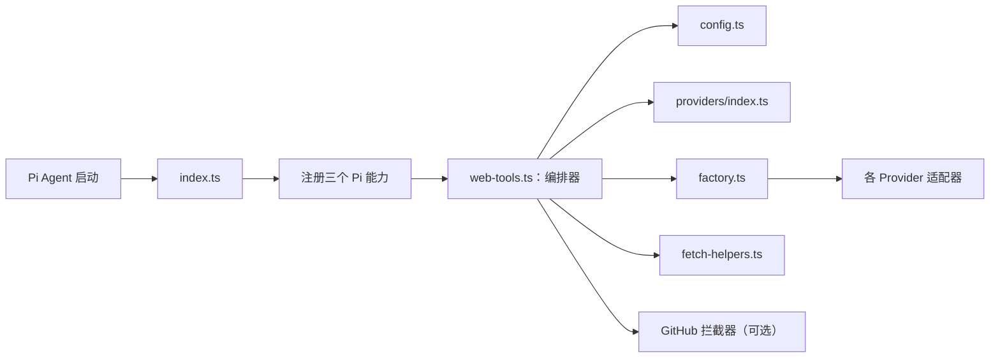
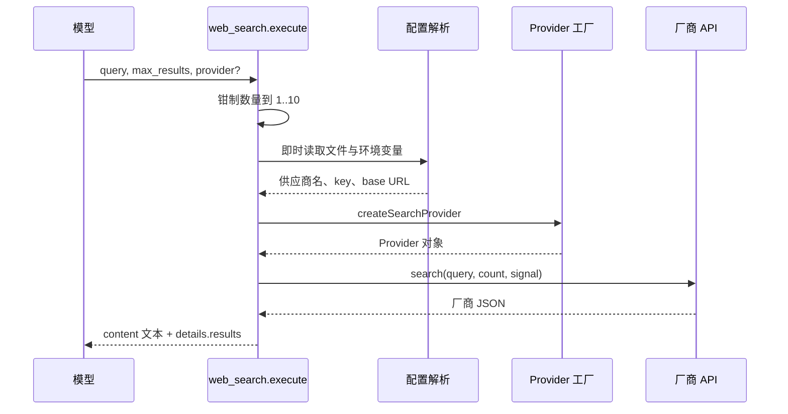

# rpiv-web-tools 项目解析：从 Pi 扩展到可插拔联网工具

> 目标：理解项目如何把“模型需要联网”实现为两个稳定的 Pi 工具；能够从零复刻最小版本，再加入多供应商、配置、安全防护、截断和 GitHub 专用读取。定位均以当前源码的 文件:行号 为准。

## 1. 结论与主线

rpiv-web-tools 不是独立 HTTP 服务，而是一个运行在 Pi Agent 宿主进程里的 TypeScript 扩展。它注册了：

- web_search：向可选搜索供应商请求结果，统一输出标题、URL、摘要。
- web_fetch：读取公开 URL，优先用供应商正文提取，必要时用内置 HTTP + HTML 转文本。
- /web-tools：选择供应商并保存 API key 或自托管地址。
- 可选 GitHub URL 拦截器：把仓库网页转换为目录树、文件内容或浅克隆内容。

项目最重要的设计是隔离。每家 API 的请求格式、认证方式和 JSON 结构都封装在 providers 目录；上层只认统一的 SearchResult 和 FetchResponse。于是新增供应商通常不必改动工具主流程。

## 2. 文件地图：每个模块的定位

| 文件 | 责任 | 为什么这样拆 |
| --- | --- | --- |
| [index.ts](../index.ts) | 扩展入口和公共导出 | 对 Pi 保持极薄的装配面。 |
| [web-tools.ts](../web-tools.ts) | 两个工具、命令、调度、结果格式、安全与截断 | 业务主线集中，供应商细节不泄漏。 |
| [providers/types.ts](../providers/types.ts) | 统一领域契约 | 所有厂商结果转成同一语言。 |
| [providers/index.ts](../providers/index.ts) | 元数据注册表 | picker、schema、优先级代码由同一份清单驱动。 |
| [providers/factory.ts](../providers/factory.ts) | 名称到实例的分派 | 使编排层不依赖具体类。 |
| [providers/config.ts](../providers/config.ts) | 配置 schema 和读写 | 对坏配置 fail-soft，避免扩展拖垮 Pi 会话。 |
| [providers/fetch-helpers.ts](../providers/fetch-helpers.ts) | 通用网页抓取后备方案 | 没有原生抓取 API 的供应商也能完成 web_fetch。 |
| [providers/*.ts](../providers) | 各供应商 API 适配器 | 每个文件只处理一个外部协议。 |
| [providers/interceptors/](../providers/interceptors) | URL 专家扩展点 | 少数 URL 可用专属读取策略而不污染通用流程。 |
| [index.test.ts](../index.test.ts) 等测试 | 可执行行为规格 | 覆盖优先级、异常、渲染和安全边界。 |

## 3. 启动时：58 行入口如何完成装配

[index.ts](../index.ts) 中值得逐行看的部分：

| 行 | 名称/代码块 | 作用 |
| --- | --- | --- |
| 1–9 | 文件注释 | 明确入口只注册能力，主体在 web-tools.ts。 |
| 11–13 | imports | 取 Pi 的类型、拦截器构造器、三个注册函数。使用 .js 是 ESM 的模块路径约定。 |
| 15–42 | re-export | 对外暴露工厂、类型、拦截器和注册函数，消费者无需知道内部目录。 |
| 47–51 | RegisterOptions | 调用方可程序化启用 GitHub 拦截器；默认关闭。 |
| 53–58 | registerWebTools | 先构造拦截器，再注册 web_search、web_fetch、/web-tools。 |

从零开发时可先只写这一层：默认导出一个 receive Pi ExtensionAPI 的函数，然后调用 pi.registerTool。入口应只负责组装，不要把网络、配置、UI 全塞进来。

## 4. 搜索主线：一次 web_search 如何返回结果

源码按此顺序阅读：

1. web-tools.ts:311 的 registerWebSearchTool 向 Pi 注册名称、描述、模型 guidance 和 TypeBox 参数 schema。
2. execute 位于 346–371：调用 clampSearchResultCount（209–212），将未给的数量设为 5，任何数值压到 1–10。
3. loadConfig 在 72 处只是 readConfig 的本地别名；每个工具调用都会读一次，所以配置更新无需重启。
4. instantiateProvider（177–200）是关键汇合点：选择供应商、解析凭据、创建实例。
5. provider.search 将厂商原始 JSON 标准化为 SearchResult 数组。
6. 零结果走 buildEmptyResultsEnvelope（300–305）；普通结果由 formatSearchResultsBody（292–298）格式化，同时保留结构化 details。

## 5. 抓取主线：web_fetch 的三层调度

web-tools.ts:408–515 的 execute 是项目最重要的一段防御式代码：

1. 先执行 parseAndAssertHttpUrl（234–248）：URL 必须可解析、协议必须是 HTTP(S)、主机不能是本机或私网。
2. 依次调用 getInterceptors 返回的拦截器（451–457）。能处理则返回 FetchResponse；不能处理必须返回 null。
3. 若 Provider 结构上有 fetch 方法（458–460），使用厂商原生正文提取。
4. 否则调用 fetchViaGenericHtml（461–463），下载网页并转文本。
5. 统一调用 Pi 的 truncateHead（466–484）。超过 2000 行或 50 KiB 时，把完整文本写到临时目录，并在输出中留下路径。

这条链可概括为：

    URL guard -> URL specialist -> native extraction -> generic HTML -> truncate/spill

顺序不可颠倒。特别是 host guard 必须在拦截器之前，否则专用拦截器可能意外成为 SSRF 绕过点。

## 6. 契约：为何 Provider 能自由替换

[providers/types.ts](../providers/types.ts) 是扩展性的根：

| 行 | 名称 | 代码职责 |
| --- | --- | --- |
| 1–10 | SearchResult、SearchResponse | 规定搜索的唯一标准输出：title、url、snippet。 |
| 12–17 | FetchResponse | 正文加可选 title、contentType、contentLength。 |
| 24–29 | SearchProvider | 最小能力：身份字段 + search。 |
| 31–38 | FetchProvider、FullProvider | 抓取能力独立；FullProvider 是 search 与 fetch 的交集。 |
| 46–52 | UserInput、isCancellation | 抹平不同 UI 对取消返回 null/undefined 的差异。 |
| 59–76 | ProviderConfigUi/Current/Change | Provider 拥有配置问答，却不反向依赖编排器。 |
| 87–100 | ProviderMeta | 名称、环境变量、base URL、角色和配置回调的声明。 |

运行时不靠 roles 做分流，而是使用 “fetch” in provider 的结构能力检查。roles 更像注册表和未来 UI 的事实说明，避免实现能力与枚举信息绑死。

## 7. 工厂、注册表与十家 API

providers/index.ts:70–81 的 PROVIDERS 是唯一的供应商目录；它决定 picker 顺序、合法 provider 名和 schema 枚举。factory.ts:22–47 的 createSearchProvider 则把字符串变为具体类。两者缺一不可。

| Provider | 文件 | 搜索 | 原生抓取 | 正文形式 |
| --- | --- | --- | --- | --- |
| Brave | brave.ts | GET + X-Subscription-Token | 否 | 通用 HTML |
| Tavily | tavily.ts | POST /search | 是 /extract | 纯文本 |
| Serper | serper.ts | POST + X-API-KEY | 否 | 通用 HTML |
| Exa | exa.ts | POST /search | 是 /contents | 纯文本 |
| You.com | youcom.ts | POST /v1/search | 是 /v1/contents | Markdown |
| Jina | jina.ts | GET，查询在 URL path | 是 Reader | Markdown |
| Firecrawl | firecrawl.ts | POST /search | 是 /scrape | Markdown |
| Perplexity | perplexity.ts | POST /search | 否 | 通用 HTML |
| SearXNG | searxng.ts | 自托管 GET /search | 否 | 通用 HTML |
| Ollama | ollama.ts | 自托管/云端 API | 是 | 原生 web fetch |

小型 hosted Provider 都有同一骨架：

    常量和厂商响应局部类型
    -> normalizeXxxResults（纯字段转换）
    -> Provider 类保存 key
    -> search：检查 key、请求、检查非 2xx、规范化
    -> 可选 fetch：原生提取、检查空正文

例如 [brave.ts:16](../providers/brave.ts:16) 的 normalizeBraveResults 不做副作用，仅翻译字段；[brave.ts:31](../providers/brave.ts:31) 的 search 才执行网络请求。这种分离让 mapping 容易测试和审查。

### 新增供应商的完整清单

1. 新建 providers/acme.ts：meta、局部厂商类型、normalize、AcmeProvider。
2. 实现 SearchProvider；只有厂商确有正文提取 API 才实现 FullProvider。
3. 若是自托管服务，在 meta 增加 baseUrlEnvVar、defaultBaseUrl、configure。
4. 在 factory.ts 加 case，在 providers/index.ts 加 re-export 与 PROVIDERS 项。
5. 为认证、请求体、成功映射、非 2xx、空内容和配置优先级补测试。

无需修改 web_search/web_fetch 执行主线；这是本项目最可复用的“开闭”设计。

## 8. 配置：三条优先级链

[providers/config.ts](../providers/config.ts) 的 WebToolsConfigSchema（56–68）让所有字段可选，并允许未知字段保存下来。readConfig（83–89）在解析错误、文件是目录或 schema 不合法时返回空对象，而不是让 Pi 会话崩溃。

| 解析对象 | 高优先级 -> 低优先级 | 代码 |
| --- | --- | --- |
| 当前搜索供应商 | 调用参数 provider -> WEB_SEARCH_PROVIDER -> config.provider -> brave | web-tools.ts:150–200 |
| 该供应商 key | 专属环境变量 -> config.apiKeys[name] -> config.apiKey（仅旧 Brave） | 102–117 |
| 自托管 base URL | SEARXNG_URL/OLLAMA_HOST -> config.baseUrls[name] -> meta 默认值 | 124–131 |

重要语义：provider 覆盖不会“借用”当前供应商的 key。指定 Exa 就必须有 Exa 凭据；缺失时明确失败。这比静默回退更适合 Agent，因为调用者知道真实发生了什么。

/web-tools 的实现位于 580–715：--show 只读显示；picker 把当前供应商排第一；声明 configure 的 SearXNG/Ollama 自己完成 URL + 可选 key 的问答；其他 Provider 走统一 API key 输入框。两个保存路径都会删除旧顶层 apiKey，完成 Brave 旧配置迁移。

## 9. 通用抓取：fetch-helpers.ts 的每个函数

| 行 | 函数 | 定位 |
| --- | --- | --- |
| 35–45 | stripNonContentBlocks、convertBlockTagsToNewlines、stripRemainingTags | 去除脚本/样式/标签，同时保留段落结构。 |
| 47–60 | decodeHtmlEntities、collapseWhitespace | 将实体和空白压成可读文本。 |
| 62–75 | htmlToText、extractTitle | 合成 HTML 正文转换与 title 提取。 |
| 81–88 | isHtmlContentType、assertTextContentType | 区分 HTML，拒绝音视频图片。 |
| 95–109 | buildFetchRequestInit、fetchUrlOrThrow | 固定 User-Agent/Accept、跟随重定向、把非 2xx 抛错。 |
| 111–139 | extractBodyAsText、fetchViaGenericHtml | raw 分支、HTML 分支、响应元数据的一站式出口。 |

它故意不是完整浏览器或 DOM 解析器。复杂动态网页、反爬页面应使用有原生 extraction 的 Provider；后备方案的目标是低依赖、可预测地读取普通文本页。

## 10. 安全与上下文预算

isPrivateOrLoopbackHostname（web-tools.ts:218–232）拒绝 localhost、0/8、127/8、RFC1918、link-local、IPv6 loopback/link-local/unique-local。parseAndAssertHttpUrl 再限制协议。这阻止模型借 web_fetch 探测内部端口或云 metadata 服务。

它的边界也要看清：检查的是 URL 中的字面 host，不做 DNS 解析，也不会重新检查重定向目标。因此高度不可信的生产环境仍需要出口代理或防火墙。SearXNG/Ollama 的 localhost 属于配置的 Provider 端点，不是模型要抓取的目标网页，因而有意允许。

对正文的统一截断同样是安全边界：短内容直接给模型，长内容写入临时文件并在 details.fullOutputPath 及正文 footer 中明确指出。不要在某个 Provider 中绕开此合约。

## 11. GitHub 拦截器：可插拔的专门读取策略

[providers/interceptors/types.ts:9](../providers/interceptors/types.ts:9) 定义 UrlInterceptor：能处理 URL 时返回 FetchResponse，否则返回 null。这个协议使 GitHub 逻辑无需写进 web_fetch 的主体。

运行过程：

1. index.ts:54 调用 buildInterceptors。
2. interceptors/index.ts:28–38 读取用户配置；用户显式配置优先于调用方默认值；启用时生成活动单例。
3. web_fetch 通过 host guard 后，调用 GitHubInterceptor.intercept。
4. [github.ts:155](../providers/interceptors/github.ts:155) 的 parseGitHubUrl 只接受仓库 root、tree、blob，issues/pulls 等返回 null。
5. fetchGitHub（585–648）先检查 clone Promise 缓存；完整 SHA 或超大仓库走 gh api；其他情况 shallow clone；失败删缓存并回退 API。
6. generateCloneContent（793–890）输出目录树、目录或文件。resolveWithinRepo（686–703）以 resolve + realpath 防止 .. 和符号链接逃逸仓库。

一个细节尤其值得学：缓存值包含 clonePromise，而非仅包含完成后的路径。所以两个并发请求同一仓库会等待同一次 clone，不会重复启动 git。

## 12. 函数级快速索引

| 文件 | 重点函数/方法 | 作用 |
| --- | --- | --- |
| web-tools.ts | resolveProviderApiKey、resolveProviderBaseUrl、resolveActiveProviderName、instantiateProvider | 解析三条优先级链并创建实例。 |
| web-tools.ts | maskApiKey、clampSearchResultCount | 展示脱敏与输入范围保护。 |
| web-tools.ts | parseAndAssertHttpUrl、spillFullContentToTempFile、formatTruncationFooter | 网络安全和长内容恢复。 |
| web-tools.ts | registerWebSearchTool、registerWebFetchTool、registerWebSearchConfigCommand | Pi 公开能力的三个注册点。 |
| config.ts | getConfigPath、readConfig、writeConfig | 受 schema 保护的配置 I/O。 |
| factory.ts | createSearchProvider | Provider 名称分派。 |
| 每个 hosted provider | normalizeXxxResults、search、fetch | 厂商协议适配。 |
| searxng.ts | requireBaseUrl、buildSearchUrl、buildAuthHeaders、searchApiError、configureSearxng | 自托管 SearXNG 运行与配置。 |
| ollama.ts | isLocalHost、isConnectionRefused、search、fetch、formatError、configureOllama | local/cloud 端点切换与友好故障提示。 |
| github.ts | parseGitHubUrl、resolveGitHubOptions、fetchViaApi、execClone、cloneRepo、fetchGitHub | URL 识别、配置、API 回退和缓存克隆。 |
| github.ts | isBinaryFile、resolveWithinRepo、buildTree、buildDirListing、readReadme、generateCloneContent | 安全地把本地 clone 变为模型文本。 |

## 13. 从零实现的七次迭代

1. 固定一个搜索 API，先注册 web_search 并返回文本。
2. 引入 SearchResult 和 SearchProvider，把厂商 JSON 转换移出工具 execute。
3. 引入注册表与工厂，获得多供应商。
4. 加 schema 配置与环境变量覆盖，按调用读盘。
5. 写通用 web_fetch，再给强供应商选择性实现 fetch。
6. 在编排层加入 URL guard、截断和临时文件溢出。
7. 为特殊 URL 写 UrlInterceptor，维持“不处理返回 null”的后备协议。

每一步都执行 npm test。测试不仅验证成功结果，也锁定了优先级、取消、错误文本、临时文件、TUI 渲染和 GitHub 缓存等容易回归的非快乐路径。

## 14. 改代码前的检查清单

- 不要把 host guard 放到拦截器之后。
- 不要让缺 key 的供应商静默切换到另一个供应商。
- 不要把超长网页直接塞入 content；沿用截断与 fullOutputPath 合约。
- 不要清理 readConfig 中的未知配置字段。
- 不要把 GitHub 缓存降级为“完成后才缓存路径”；并发 clone 会重复。
- 新 Provider 必须同步更新：适配器、factory、registry、导出、测试。

## 15. 推荐阅读顺序

第一遍读 [README.md](../README.md) 和 [tools.md](tools.md)，然后读 index.ts 与 web-tools.ts:311–515，先建立用户行为和两条执行主线。

第二遍读 types.ts、providers/index.ts、factory.ts 和 brave.ts，理解扩展点。

第三遍读 config.ts、web-tools.ts:102–248、534–715，理解优先级和安全语义。

最后读 fetch-helpers.ts、searxng.ts、ollama.ts、interceptors/github.ts，并用测试文件追踪正在修改的函数。这样每一行代码都会回到“输入来自哪里、经过哪条边界、输出给谁”的主线中，而不会陷在厂商 API 细节里。

## 附：现有文档的分工

- [tools.md](tools.md)：参数、返回 envelope、dispatch、截断、host guard。
- [providers.md](providers.md)：供应商矩阵和优先级。
- [configuration.md](configuration.md)：配置文件、schema、/web-tools --show。
- [self-hosted.md](self-hosted.md)：SearXNG/Ollama 部署与错误。
- [github-interceptor.md](github-interceptor.md)：拦截器 opt-in、克隆/API fallback 与限制。

这些文档回答“怎么用”；本文回答“为什么这样实现、每块代码在主线的什么位置、怎样从零重建和扩展”。
