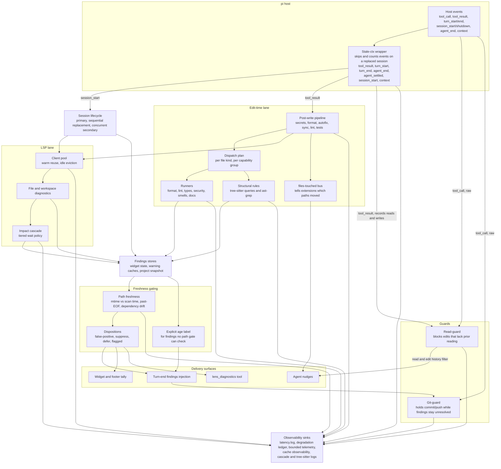

<p align="center">
  
</p>

# pi-lens

pi-lens gives AI coding agents fast, language-aware feedback while they write/edit.

> **Working in this project as an AI agent?** Read the [agent guide](docs/agent-guide.md)
> for how pi-lens surfaces diagnostics (honesty labels, blockers, read-before-edit)
> and how to respond.

## What It Does

- LSP diagnostics and navigation across supported languages
- Impact cascade diagnostics that show which related files were affected and run LSP diagnostics on them
- Language-specific linters, type-checkers, and scanners on every write/edit
- Safe formatting/autofix where tools are configured or confidently detected
- ast-grep and tree-sitter structural rules for correctness/security smells
- Agent-facing tools for LSP navigation/diagnostics, AST search/replace,
  diagnostics state, and project intelligence
- Review-graph intelligence for supported languages via bundled tree-sitter WASMs
- Ranked identifier search (`symbol_search`) over an always-warm word index,
  feeding the discovery funnel (symbol_search → module_report → read_symbol)
- Diagnostic triage (`lens_diagnostic_mark`): findings can be marked
  false-positive, suppressed in source, deferred, or flagged-to-fix — honored
  across all surfaces
- `/lens-map` — interactive HTML dependency map of the project
- Read-guard and edit-autopatch support to reduce bad edits
- Background security/dependency scans for opted-in projects
- Runtime health telemetry (`/lens-health`) including a bounded degradation
  ledger for silently-degraded behavior (LSP breakers, formatter
  skips/failures, idle evictions, timeouts)
- MCP server (experimental) so Claude Code or any MCP client can drive the
  same diagnostics/read-substitute tools pi-lens exposes to pi

## Architecture

Most lifecycle events enter through one wrapper, which drops and counts events
that arrive on a replaced session. `tool_call` registers raw: it delegates
straight to a handler that owns its own total guard. Events fan out into the
edit-time lane and the LSP lane. Both lanes write into the findings stores.
Nothing reaches the agent from those stores until a freshness gate or an
explicit age label clears it.



Architecture-level view, updated when a lane changes. Per-tool inventories live
in [features](docs/features.md) and
[language coverage](docs/language-coverage.md). Today the edit-time lane carries
45+ runner modules over 35+ file kinds, and the LSP lane speaks to a dozen-plus
language servers.

The gating box is an abstraction, not a call order. Freshness covers several
independent mechanisms: path freshness against scan time, past-EOF line checks,
and forward-import dependency drift. Dispositions are one more filter alongside
them, not a second stage every finding walks through. Read the box as "a finding
passes the gates that apply to it", and see `clients/finding-delivery-gate.ts`
for the per-surface contract.

## Install

```bash
pi install npm:pi-lens
```

Or from git:

```bash
pi install git:github.com/apmantza/pi-lens
```

> **npm v12 users:** dependency lifecycle scripts (e.g. `@ast-grep/cli`'s
> `postinstall`) now require explicit approval — if `npm install` warns about
> unreviewed install scripts, review and allow them with
> `npm approve-scripts`, or trust the `allowScripts` entries already declared
> in this package's `package.json`. Installing from a git source (`pi install
> git:...` / `pi update --extension git:...`) may similarly prompt for
> git-dependency approval; accept it to let the `prepare` build step run.

## Documentation

- [Agent guide](docs/agent-guide.md) — how an AI agent should consume and respond to pi-lens
- [Agent tools](docs/agent-tools.md) — pi tool names, scopes, and arguments
- [Usage guide](docs/usage.md) — lifecycle, tool behavior, MCP notes, and
  troubleshooting
- [Features](docs/features.md) — detailed feature reference
- [Word index](docs/word-index.md) — identifier search (`symbol_search`) and
  the discovery funnel
- [Tools and commands](docs/tools.md) — runtime flags and slash commands
- [Diagnostic dispositions](docs/dispositions.md) — triage: false-positive,
  suppress, defer, flagged-to-fix
- [Settings](docs/settings.md) — the configuration hub: defaults, env vars, CLI
  flags, and global vs project config at a glance
- [Configuration](docs/globalconfig.md) — global and project config files
- [Environment variables](docs/environment-variables.md) — common env vars and
  full reference
- [Language coverage](docs/language-coverage.md) — supported languages, runners,
  and formatters
- [Dependencies](docs/dependencies.md) — auto-install policy and external tools
- [Custom rules](docs/custom-rules.md) — project ast-grep and tree-sitter rules
- [MCP server](docs/mcp.md) — experimental MCP server for Claude Code and
  other MCP clients

## Contributing

See [`CONTRIBUTING.md`](CONTRIBUTING.md) for the development workflow, runner,
LSP, formatter, and rule checklists, and issue/PR conventions.

Security issues should be reported privately; see [`SECURITY.md`](SECURITY.md).
pi-lens is released under the [MIT License](LICENSE).

## Contributors

Thanks goes to these wonderful people:
<!-- ALL-CONTRIBUTORS-LIST:START - Do not remove or modify this section -->
<!-- prettier-ignore-start -->
<!-- markdownlint-disable -->
<table>
  <tbody>
    <tr>
      <td align="center" valign="top" width="14.28%"><a href="https://github.com/apmantza"><br /><sub><b>Apostolos Mantzaris</b></sub></a><br /><a href="#code-apmantza" title="Code">💻</a> <a href="#doc-apmantza" title="Documentation">📖</a> <a href="#ideas-apmantza" title="Ideas & Planning">🤔</a> <a href="#maintenance-apmantza" title="Maintenance">🚧</a> <a href="#review-apmantza" title="Reviewed Pull Requests">👀</a></td>
      <td align="center" valign="top" width="14.28%"><a href="https://github.com/AngriestBird"><br /><sub><b>Kenneth McCormick</b></sub></a><br /><a href="#bug-AngriestBird" title="Bug reports">🐛</a> <a href="#code-AngriestBird" title="Code">💻</a></td>
      <td align="center" valign="top" width="14.28%"><a href="https://github.com/anh-chu"><br /><sub><b>Anh Chu</b></sub></a><br /><a href="#code-anh-chu" title="Code">💻</a></td>
      <td align="center" valign="top" width="14.28%"><a href="https://github.com/loss-and-quick"><br /><sub><b>minicx</b></sub></a><br /><a href="#code-loss-and-quick" title="Code">💻</a></td>
      <td align="center" valign="top" width="14.28%"><a href="https://github.com/silvanshade"><br /><sub><b>silvanshade</b></sub></a><br /><a href="#code-silvanshade" title="Code">💻</a></td>
      <td align="center" valign="top" width="14.28%"><a href="https://github.com/tifandotme"><br /><sub><b>Tifan Dwi Avianto</b></sub></a><br /><a href="#code-tifandotme" title="Code">💻</a></td>
      <td align="center" valign="top" width="14.28%"><a href="https://github.com/amit-gshe"><br /><sub><b>Amit</b></sub></a><br /><a href="#code-amit-gshe" title="Code">💻</a> <a href="#bug-amit-gshe" title="Bug reports">🐛</a></td>
    </tr>
    <tr>
      <td align="center" valign="top" width="14.28%"><a href="https://github.com/fractiunate"><br /><sub><b>Fractiunate // David Rahäuser</b></sub></a><br /><a href="#code-fractiunate" title="Code">💻</a></td>
      <td align="center" valign="top" width="14.28%"><a href="https://github.com/vkarasen"><br /><sub><b>Vitali Karasenko</b></sub></a><br /><a href="#code-vkarasen" title="Code">💻</a></td>
      <td align="center" valign="top" width="14.28%"><a href="https://github.com/rfxlamia"><br /><sub><b>V</b></sub></a><br /><a href="#code-rfxlamia" title="Code">💻</a></td>
      <td align="center" valign="top" width="14.28%"><a href="https://github.com/fabio-dee"><br /><sub><b>Fabio Dee</b></sub></a><br /><a href="#code-fabio-dee" title="Code">💻</a></td>
      <td align="center" valign="top" width="14.28%"><a href="https://github.com/moj02090"><br /><sub><b>moj02090</b></sub></a><br /><a href="#code-moj02090" title="Code">💻</a></td>
      <td align="center" valign="top" width="14.28%"><a href="https://github.com/mehalter"><br /><sub><b>Micah Halter</b></sub></a><br /><a href="#code-mehalter" title="Code">💻</a></td>
      <td align="center" valign="top" width="14.28%"><a href="https://github.com/JulienEllie"><br /><sub><b>Julien Ellie</b></sub></a><br /><a href="#code-JulienEllie" title="Code">💻</a></td>
    </tr>
    <tr>
      <td align="center" valign="top" width="14.28%"><a href="https://github.com/Istar-Eldritch"><br /><sub><b>Ruben Paz</b></sub></a><br /><a href="#code-Istar-Eldritch" title="Code">💻</a> <a href="#bug-Istar-Eldritch" title="Bug reports">🐛</a></td>
      <td align="center" valign="top" width="14.28%"><a href="https://github.com/cjunxiang"><br /><sub><b>C.Junxiang</b></sub></a><br /><a href="#code-cjunxiang" title="Code">💻</a> <a href="#bug-cjunxiang" title="Bug reports">🐛</a></td>
      <td align="center" valign="top" width="14.28%"><a href="https://github.com/trvon"><br /><sub><b>Trevon</b></sub></a><br /><a href="#code-trvon" title="Code">💻</a></td>
      <td align="center" valign="top" width="14.28%"><a href="https://github.com/cmptr"><br /><sub><b>Aaron Bell</b></sub></a><br /><a href="#code-cmptr" title="Code">💻</a> <a href="#bug-cmptr" title="Bug reports">🐛</a></td>
      <td align="center" valign="top" width="14.28%"><a href="https://github.com/StartupBros"><br /><sub><b>Will Mitchell</b></sub></a><br /><a href="#code-StartupBros" title="Code">💻</a></td>
      <td align="center" valign="top" width="14.28%"><a href="https://github.com/spyrosbazios"><br /><sub><b>spyrosbazios</b></sub></a><br /><a href="#code-spyrosbazios" title="Code">💻</a></td>
      <td align="center" valign="top" width="14.28%"><a href="https://github.com/Roman-Galeev"><br /><sub><b>Roman Galeev</b></sub></a><br /><a href="#code-Roman-Galeev" title="Code">💻</a></td>
    </tr>
    <tr>
      <td align="center" valign="top" width="14.28%"><a href="https://github.com/jerryfan"><br /><sub><b>jerryfan</b></sub></a><br /><a href="#code-jerryfan" title="Code">💻</a></td>
      <td align="center" valign="top" width="14.28%"><a href="https://github.com/shaDmx"><br /><sub><b>Max L.</b></sub></a><br /><a href="#code-shaDmx" title="Code">💻</a></td>
      <td align="center" valign="top" width="14.28%"><a href="https://github.com/radge"><br /><sub><b>David Ryan</b></sub></a><br /><a href="#code-radge" title="Code">💻</a></td>
      <td align="center" valign="top" width="14.28%"><a href="https://github.com/JayceFreeman"><br /><sub><b>JayceFreeman</b></sub></a><br /><a href="#code-JayceFreeman" title="Code">💻</a></td>
      <td align="center" valign="top" width="14.28%"><a href="https://github.com/bloodf"><br /><sub><b>Heitor Ramon Ribeiro</b></sub></a><br /><a href="#code-bloodf" title="Code">💻</a></td>
      <td align="center" valign="top" width="14.28%"><a href="https://github.com/feoh"><br /><sub><b>Chris Patti</b></sub></a><br /><a href="#code-feoh" title="Code">💻</a> <a href="#bug-feoh" title="Bug reports">🐛</a></td>
      <td align="center" valign="top" width="14.28%"><a href="https://github.com/chenxin-yan"><br /><sub><b>Chenxin Yan</b></sub></a><br /><a href="#code-chenxin-yan" title="Code">💻</a> <a href="#doc-chenxin-yan" title="Documentation">📖</a> <a href="#bug-chenxin-yan" title="Bug reports">🐛</a></td>
    </tr>
    <tr>
      <td align="center" valign="top" width="14.28%"><a href="https://github.com/flowing-abyss"><br /><sub><b>flowing-abyss</b></sub></a><br /><a href="#code-flowing-abyss" title="Code">💻</a></td>
      <td align="center" valign="top" width="14.28%"><a href="https://github.com/shaochong-theoai"><br /><sub><b>shaochong-theoai</b></sub></a><br /><a href="#code-shaochong-theoai" title="Code">💻</a></td>
      <td align="center" valign="top" width="14.28%"><a href="https://github.com/xuli500177"><br /><sub><b>Xu Yili</b></sub></a><br /><a href="#bug-xuli500177" title="Bug reports">🐛</a> <a href="#code-xuli500177" title="Code">💻</a></td>
      <td align="center" valign="top" width="14.28%"><a href="https://github.com/ricardoraposo"><br /><sub><b>Ricardo Raposo</b></sub></a><br /><a href="#code-ricardoraposo" title="Code">💻</a></td>
      <td align="center" valign="top" width="14.28%"><a href="https://github.com/jsmestad"><br /><sub><b>Justin Smestad</b></sub></a><br /><a href="#code-jsmestad" title="Code">💻</a></td>
      <td align="center" valign="top" width="14.28%"><a href="https://github.com/anasalsbey-glitch"><br /><sub><b>anasalsbey-glitch</b></sub></a><br /><a href="#code-anasalsbey-glitch" title="Code">💻</a> <a href="#bug-anasalsbey-glitch" title="Bug reports">🐛</a></td>
      <td align="center" valign="top" width="14.28%"><a href="https://github.com/PeraSite"><br /><sub><b>정제훈</b></sub></a><br /><a href="#code-PeraSite" title="Code">💻</a></td>
    </tr>
    <tr>
      <td align="center" valign="top" width="14.28%"><a href="https://github.com/ymek"><br /><sub><b>Myke Stubbs</b></sub></a><br /><a href="#code-ymek" title="Code">💻</a> <a href="#bug-ymek" title="Bug reports">🐛</a></td>
      <td align="center" valign="top" width="14.28%"><a href="https://github.com/JSap0914"><br /><sub><b>JSap0914</b></sub></a><br /><a href="#code-JSap0914" title="Code">💻</a></td>
      <td align="center" valign="top" width="14.28%"><a href="https://github.com/knthmn"><br /><sub><b>Kent Hou Man</b></sub></a><br /><a href="#code-knthmn" title="Code">💻</a> <a href="#bug-knthmn" title="Bug reports">🐛</a></td>
      <td align="center" valign="top" width="14.28%"><a href="https://neumie.dev/"><br /><sub><b>Jakub Neumann</b></sub></a><br /><a href="#code-neumie" title="Code">💻</a></td>
      <td align="center" valign="top" width="14.28%"><a href="https://github.com/cy7372"><br /><sub><b>CyYu</b></sub></a><br /><a href="#code-cy7372" title="Code">💻</a></td>
      <td align="center" valign="top" width="14.28%"><a href="https://github.com/carolitascl"><br /><sub><b>Carolina</b></sub></a><br /><a href="#bug-carolitascl" title="Bug reports">🐛</a></td>
      <td align="center" valign="top" width="14.28%"><a href="https://github.com/leakedby"><br /><sub><b>LeakedBy</b></sub></a><br /><a href="#bug-leakedby" title="Bug reports">🐛</a></td>
    </tr>
    <tr>
      <td align="center" valign="top" width="14.28%"><a href="https://github.com/mdbooth"><br /><sub><b>Matthew Booth</b></sub></a><br /><a href="#bug-mdbooth" title="Bug reports">🐛</a></td>
      <td align="center" valign="top" width="14.28%"><a href="https://github.com/Wiedzmin89"><br /><sub><b>Wiedzmin89</b></sub></a><br /><a href="#ideas-Wiedzmin89" title="Ideas & Planning">🤔</a></td>
      <td align="center" valign="top" width="14.28%"><a href="https://github.com/grodingo"><br /><sub><b>Virgile</b></sub></a><br /><a href="#bug-grodingo" title="Bug reports">🐛</a></td>
      <td align="center" valign="top" width="14.28%"><a href="https://github.com/finnvyrn"><br /><sub><b>Finn</b></sub></a><br /><a href="#ideas-finnvyrn" title="Ideas & Planning">🤔</a></td>
      <td align="center" valign="top" width="14.28%"><a href="https://github.com/ywh555hhh"><br /><sub><b>Wayne E</b></sub></a><br /><a href="#bug-ywh555hhh" title="Bug reports">🐛</a></td>
      <td align="center" valign="top" width="14.28%"><a href="https://github.com/RimuruW"><br /><sub><b>RimuruW</b></sub></a><br /><a href="#ideas-RimuruW" title="Ideas & Planning">🤔</a></td>
      <td align="center" valign="top" width="14.28%"><a href="https://github.com/Bjynt"><br /><sub><b>Bjynt</b></sub></a><br /><a href="#bug-Bjynt" title="Bug reports">🐛</a> <a href="#ideas-Bjynt" title="Ideas & Planning">🤔</a></td>
    </tr>
    <tr>
      <td align="center" valign="top" width="14.28%"><a href="https://github.com/pvtri96"><br /><sub><b>Tri Van Pham</b></sub></a><br /><a href="#bug-pvtri96" title="Bug reports">🐛</a></td>
      <td align="center" valign="top" width="14.28%"><a href="https://github.com/BingWuJ"><br /><sub><b>BingWuJ</b></sub></a><br /><a href="#bug-BingWuJ" title="Bug reports">🐛</a></td>
      <td align="center" valign="top" width="14.28%"><a href="https://github.com/tackleberrybey"><br /><sub><b>tackleberrybey</b></sub></a><br /><a href="#bug-tackleberrybey" title="Bug reports">🐛</a></td>
      <td align="center" valign="top" width="14.28%"><a href="https://github.com/TaterDoge"><br /><sub><b>Mariann Abshire</b></sub></a><br /><a href="#bug-TaterDoge" title="Bug reports">🐛</a></td>
      <td align="center" valign="top" width="14.28%"><a href="https://github.com/ProbabilityEngineer"><br /><sub><b>ProbabilityEngineer</b></sub></a><br /><a href="#ideas-ProbabilityEngineer" title="Ideas & Planning">🤔</a></td>
      <td align="center" valign="top" width="14.28%"><a href="https://github.com/LeonardoRick"><br /><sub><b>Leonardo Rick</b></sub></a><br /><a href="#bug-LeonardoRick" title="Bug reports">🐛</a> <a href="#ideas-LeonardoRick" title="Ideas & Planning">🤔</a></td>
      <td align="center" valign="top" width="14.28%"><a href="https://github.com/kenbanks-peng"><br /><sub><b>Ken Banks</b></sub></a><br /><a href="#bug-kenbanks-peng" title="Bug reports">🐛</a></td>
    </tr>
    <tr>
      <td align="center" valign="top" width="14.28%"><a href="https://github.com/rstacruz"><br /><sub><b>Rico Sta. Cruz</b></sub></a><br /><a href="#ideas-rstacruz" title="Ideas & Planning">🤔</a></td>
      <td align="center" valign="top" width="14.28%"><a href="https://github.com/acidnik"><br /><sub><b>Nikita Bilous</b></sub></a><br /><a href="#bug-acidnik" title="Bug reports">🐛</a></td>
      <td align="center" valign="top" width="14.28%"><a href="https://github.com/av1155"><br /><sub><b>Andrea Arturo Venti Fuentes</b></sub></a><br /><a href="#bug-av1155" title="Bug reports">🐛</a></td>
      <td align="center" valign="top" width="14.28%"><a href="https://github.com/dacec354"><br /><sub><b>dacec354</b></sub></a><br /><a href="#bug-dacec354" title="Bug reports">🐛</a></td>
      <td align="center" valign="top" width="14.28%"><a href="https://github.com/nodnarbnitram"><br /><sub><b>Brandon Martin</b></sub></a><br /><a href="#bug-nodnarbnitram" title="Bug reports">🐛</a></td>
      <td align="center" valign="top" width="14.28%"><a href="https://github.com/alpertarhan"><br /><sub><b>Alper Tarhan</b></sub></a><br /><a href="#bug-alpertarhan" title="Bug reports">🐛</a></td>
      <td align="center" valign="top" width="14.28%"><a href="https://github.com/asolopovas"><br /><sub><b>Andrius Solopovas</b></sub></a><br /><a href="#bug-asolopovas" title="Bug reports">🐛</a></td>
    </tr>
    <tr>
      <td align="center" valign="top" width="14.28%"><a href="https://github.com/GrahamJenkins"><br /><sub><b>Graham Jenkins</b></sub></a><br /><a href="#bug-GrahamJenkins" title="Bug reports">🐛</a></td>
      <td align="center" valign="top" width="14.28%"><a href="https://github.com/wings1848"><br /><sub><b>Wings Butterfly</b></sub></a><br /><a href="#bug-wings1848" title="Bug reports">🐛</a></td>
      <td align="center" valign="top" width="14.28%"><a href="https://github.com/JohannesKlauss"><br /><sub><b>Johannes Klauss</b></sub></a><br /><a href="#ideas-JohannesKlauss" title="Ideas & Planning">🤔</a></td>
      <td align="center" valign="top" width="14.28%"><a href="https://github.com/tan-yong-sheng"><br /><sub><b>Tan Yong Sheng</b></sub></a><br /><a href="#ideas-tan-yong-sheng" title="Ideas & Planning">🤔</a></td>
      <td align="center" valign="top" width="14.28%"><a href="https://github.com/fmatray"><br /><sub><b>Frédéric</b></sub></a><br /><a href="#bug-fmatray" title="Bug reports">🐛</a></td>
      <td align="center" valign="top" width="14.28%"><a href="https://github.com/fuentesjr"><br /><sub><b>Salvador Fuentes Jr</b></sub></a><br /><a href="#bug-fuentesjr" title="Bug reports">🐛</a></td>
      <td align="center" valign="top" width="14.28%"><a href="https://github.com/Viterkim"><br /><sub><b>Viktor</b></sub></a><br /><a href="#bug-Viterkim" title="Bug reports">🐛</a></td>
    </tr>
    <tr>
      <td align="center" valign="top" width="14.28%"><a href="https://github.com/ortonomy"><br /><sub><b>Gregory Orton</b></sub></a><br /><a href="#bug-ortonomy" title="Bug reports">🐛</a></td>
      <td align="center" valign="top" width="14.28%"><a href="https://github.com/jimallen"><br /><sub><b>Jim Allen</b></sub></a><br /><a href="#bug-jimallen" title="Bug reports">🐛</a></td>
      <td align="center" valign="top" width="14.28%"><a href="https://github.com/quantfiction"><br /><sub><b>quantfiction</b></sub></a><br /><a href="#bug-quantfiction" title="Bug reports">🐛</a></td>
      <td align="center" valign="top" width="14.28%"><a href="https://github.com/Artawower"><br /><sub><b>Art</b></sub></a><br /><a href="#bug-Artawower" title="Bug reports">🐛</a></td>
      <td align="center" valign="top" width="14.28%"><a href="https://github.com/chozandrias76"><br /><sub><b>Colin Swenson-Healey</b></sub></a><br /><a href="#bug-chozandrias76" title="Bug reports">🐛</a></td>
      <td align="center" valign="top" width="14.28%"><a href="https://github.com/JustlyAI"><br /><sub><b>Laurent Wiesel</b></sub></a><br /><a href="#bug-JustlyAI" title="Bug reports">🐛</a></td>
      <td align="center" valign="top" width="14.28%"><a href="https://github.com/stark-bit"><br /><sub><b>Rei Starks</b></sub></a><br /><a href="#bug-stark-bit" title="Bug reports">🐛</a></td>
    </tr>
    <tr>
      <td align="center" valign="top" width="14.28%"><a href="https://github.com/robertoecf"><br /><sub><b>Roberto Freitas</b></sub></a><br /><a href="#bug-robertoecf" title="Bug reports">🐛</a></td>
      <td align="center" valign="top" width="14.28%"><a href="https://github.com/tmttodd"><br /><sub><b>tmttodd</b></sub></a><br /><a href="#bug-tmttodd" title="Bug reports">🐛</a></td>
      <td align="center" valign="top" width="14.28%"><a href="https://github.com/smaharnav"><br /><sub><b>smaharnav</b></sub></a><br /><a href="#bug-smaharnav" title="Bug reports">🐛</a></td>
      <td align="center" valign="top" width="14.28%"><a href="https://github.com/MzaGuille"><br /><sub><b>Mza.Guille</b></sub></a><br /><a href="#bug-MzaGuille" title="Bug reports">🐛</a></td>
      <td align="center" valign="top" width="14.28%"><a href="http://jasonrimmer.com/"><br /><sub><b>Jason Rimmer</b></sub></a><br /><a href="#bug-jrimmer" title="Bug reports">🐛</a></td>
      <td align="center" valign="top" width="14.28%"><a href="https://github.com/ArthurHeymans"><br /><sub><b>Arthur Heymans</b></sub></a><br /><a href="#ideas-ArthurHeymans" title="Ideas & Planning">🤔</a></td>
      <td align="center" valign="top" width="14.28%"><a href="https://github.com/Blue-B"><br /><sub><b>Blue-B</b></sub></a><br /><a href="#bug-Blue-B" title="Bug reports">🐛</a></td>
    </tr>
    <tr>
      <td align="center" valign="top" width="14.28%"><a href="https://github.com/bisko"><br /><sub><b>Biser Perchinkov</b></sub></a><br /><a href="#bug-bisko" title="Bug reports">🐛</a></td>
      <td align="center" valign="top" width="14.28%"><a href="https://github.com/xificurC"><br /><sub><b>Peter Nagy</b></sub></a><br /><a href="#bug-xificurC" title="Bug reports">🐛</a></td>
      <td align="center" valign="top" width="14.28%"><a href="https://github.com/orest-tokovenko-block"><br /><sub><b>Orest Tokovenko</b></sub></a><br /><a href="#bug-orest-tokovenko-block" title="Bug reports">🐛</a></td>
      <td align="center" valign="top" width="14.28%"><a href="https://eisterman.dev/"><br /><sub><b>Federico Pasqua</b></sub></a><br /><a href="#bug-eisterman" title="Bug reports">🐛</a></td>
      <td align="center" valign="top" width="14.28%"><a href="https://github.com/black-snow"><br /><sub><b>Ronald</b></sub></a><br /><a href="#bug-black-snow" title="Bug reports">🐛</a></td>
      <td align="center" valign="top" width="14.28%"><a href="https://github.com/aaronkyriesenbach"><br /><sub><b>Aaron Ky-Riesenbach</b></sub></a><br /><a href="#bug-aaronkyriesenbach" title="Bug reports">🐛</a></td>
      <td align="center" valign="top" width="14.28%"><a href="https://github.com/LovelyLoong"><br /><sub><b>可爱的龙</b></sub></a><br /><a href="#bug-LovelyLoong" title="Bug reports">🐛</a></td>
    </tr>
    <tr>
      <td align="center" valign="top" width="14.28%"><a href="https://github.com/pppobear"><br /><sub><b>pppobear</b></sub></a><br /><a href="#bug-pppobear" title="Bug reports">🐛</a></td>
      <td align="center" valign="top" width="14.28%"><a href="https://github.com/bcachet"><br /><sub><b>Bertrand Cachet</b></sub></a><br /><a href="#code-bcachet" title="Code">💻</a></td>
      <td align="center" valign="top" width="14.28%"><a href="https://github.com/EarthChen"><br /><sub><b>earthchen</b></sub></a><br /><a href="#code-EarthChen" title="Code">💻</a></td>
      <td align="center" valign="top" width="14.28%"><a href="https://github.com/Don-Yin"><br /><sub><b>Don Yin</b></sub></a><br /><a href="#code-Don-Yin" title="Code">💻</a></td>
      <td align="center" valign="top" width="14.28%"><a href="https://github.com/ELA718"><br /><sub><b>ELA718</b></sub></a><br /><a href="#doc-ELA718" title="Documentation">📖</a></td>
      <td align="center" valign="top" width="14.28%"><a href="https://github.com/sujeito-operator/pilot"><br /><sub><b>Sujeito Operator</b></sub></a><br /><a href="#code-sujeito-operator" title="Code">💻</a></td>
      <td align="center" valign="top" width="14.28%"><a href="http://www.blahs.life/"><br /><sub><b>Dan Blah</b></sub></a><br /><a href="#bug-danblah" title="Bug reports">🐛</a></td>
    </tr>
    <tr>
      <td align="center" valign="top" width="14.28%"><a href="https://github.com/3choBoomer"><br /><sub><b>Nathan Cooke</b></sub></a><br /><a href="#code-3choBoomer" title="Code">💻</a></td>
      <td align="center" valign="top" width="14.28%"><a href="https://github.com/white-hat"><br /><sub><b>Eli Stark</b></sub></a><br /><a href="#code-white-hat" title="Code">💻</a></td>
      <td align="center" valign="top" width="14.28%"><a href="https://marvinaziz.de/"><br /><sub><b>Marvin Aziz</b></sub></a><br /><a href="#code-marvtub" title="Code">💻</a></td>
      <td align="center" valign="top" width="14.28%"><a href="https://github.com/mjfaga"><br /><sub><b>Mark</b></sub></a><br /><a href="#code-mjfaga" title="Code">💻</a></td>
      <td align="center" valign="top" width="14.28%"><a href="https://aeturnal.io/"><br /><sub><b>aeturnal</b></sub></a><br /><a href="#code-aeturnal" title="Code">💻</a></td>
      <td align="center" valign="top" width="14.28%"><a href="https://github.com/floatGray"><br /><sub><b>floatGray</b></sub></a><br /><a href="#code-floatGray" title="Code">💻</a></td>
    </tr>
  </tbody>
</table>

<!-- markdownlint-restore -->
<!-- prettier-ignore-end -->

<!-- ALL-CONTRIBUTORS-LIST:END -->

The following commit identities also appear in `git shortlog -sne HEAD` but are
not represented in the generated table above: Anas Alsbei, Claude,
Christopher Patti,
dependabot[bot], Fabio-D, github-actions[bot], JSup, Kenny McCormick,
Max Lupus, Moritz Hofmann, ricardo, and root.

If you land a pull request or report an issue that gets fixed, we'll add you here.
