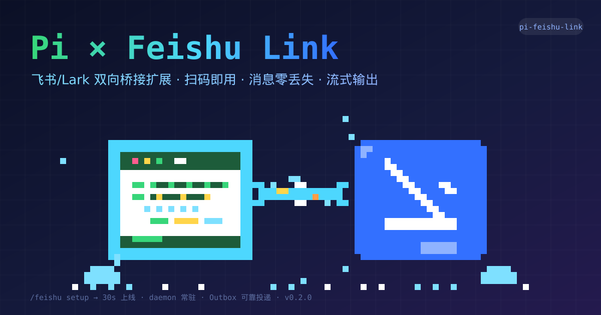

<p align="center">
  
</p>

<div align="center">

# pi-feishu-link

**Pi × 飞书/Lark 双向桥接扩展** — 扫码即用 · 消息零丢失 · 流式输出 · pi 命令原生适配

[中文](#中文) · [English](#english) · [Changelog](CHANGELOG.md) · [Design Spec](.spec/2026-08-08-2000-pi-feishu-link综合设计spec.md)

</div>

---

# 中文

> 全网统一昵称：**小斯syzs**
>
> B站 [@小斯syzs](https://space.bilibili.com/390211071) · 抖音 · 小红书 · 快手（全网同名，搜 **小斯syzs**）
>
> 💬 加入飞书交流群：**[点击加入](https://applink.feishu.cn/client/chat/chatter/add_by_link?link_token=45al067b-19ea-4fa0-bba6-d550be5fe2ea)**（反馈问题 / 交流用法）

## 特性

| 能力 | 说明 |
| ---- | ---- |
| 🎯 **一键认证** | `/feishu setup` 终端出二维码，扫码自动创建飞书应用（**自动订阅消息事件 + 群聊全量 + 表情权限**）并写入凭据，30 秒上线 |
| ✍️ **流式中间输出** | 模型文本**逐块流式显示**（工具执行/思考过程对用户隐藏），结束后固化为完整回复 |
| ⚙️ **pi 命令原生适配** | `/model`（列已认证模型+编号切换）、`/thinking`、`/compact`、`/new`、`/resume`、`/name`、`/session`、`/copy` 直接调 **pi 原生 API**，结果与 pi 终端一致 |
| 🔑 **/login API key 通道** | `/login <provider> <key>` 或交互输入——无需浏览器 OAuth，写凭据到 auth.json |
| 🔀 **插件命令原生转发** | `/goal` 等插件命令、`/skill:name`、模板、未知 `/xxx` **原样交 pi 执行**，输出自动回飞书 |
| 💪 **消息零丢失** | 出站走持久化 Outbox（JSONL 段文件 + at-least-once + 幂等键 + 分航道并行），进程被 kill 后重启自动续投 |
| 🛡 **连接自愈** | probe 心跳驱动的受控重连 + **配额熔断**（不再烧穿飞书连接配额）；断连自动重连 + **断连消息自动补收** + 主动汇报 |
| 😊 **表情回执** | 收到消息随机回一枚表情（"已收到"）；**任务完成**才对触发消息补打 ✅（DONE 不参与随机池），池可热改 |
| 🔓 **默认全部放行** | 除破坏性黑名单外一切工具调用直接放行；黑名单（`rm -rf /`、`curl\|sh` 等）弹**审批卡**（⚠️ 危险，管理员批准才执行，5min 超时自动拒绝） |
| 🩺 **一键诊断** | 飞书发 `/doctor` → **脱敏诊断包作为文件直接发回会话**，内含预填 ISSUE.md + 复现 trace，贴给 AI 即可定位 |
| ⏰ **定时任务** | 说"每天 9 点总结 commit"即可创建（可选依赖 my-pi-scheduler），结果自动回投本会话 |
| 📎 **多媒体** | 入站图片→视觉模型、文件→有界文本提取；出站图片/文件经 `feishu_send_local_file` 上传发送 |

## 快速开始

```bash
pi install npm:pi-feishu-link        # npm 发布后（或 git:github.com/amlyczz/pi-feishu-link）
pi install npm:@ineersa/my-pi-scheduler   # 可选：定时任务
pi                                    # 启动 pi
/feishu setup                         # 终端出二维码 → 手机扫码 → 凭据自动写入
/feishu start                         # 启动桥接（daemon 常驻，TUI 关闭不断线）
```

然后打开飞书，搜索你的机器人，发任意消息——收到欢迎卡即端到端连通（你的消息会带随机表情回执，任务完成打 ✅）。

> 群聊免 @：setup 扫码创建应用时**已自动申请全部所需权限**（消息事件 + 群聊全量 + 表情），发布即生效，无需手动配置。

## 命令

**三级分流**（spec §2）：桥特有命令 → 桥处理；pi 内置命令 → 原生调 pi API；其他 → 原样交 pi 执行。

### pi 终端

```text
/feishu setup       扫码创建应用（一键认证）
/feishu start       启动 daemon（常驻，TUI 关闭不断线）
/feishu stop        停止
/feishu restart     重启
/feishu takeover    接管连接
/feishu status      全链路健康视图
/feishu doctor      生成诊断包（含权限自检）
/feishu config key=value   热改配置（如 groupPolicy=mention）
```

### 飞书侧

| 类别 | 命令 | 行为 |
| ---- | ---- | ---- |
| 桥特有 | `/status` `/workspace` `/stop` `/doctor` `/feishu-config` `/help` | 桥处理（状态/工作区/诊断/热改） |
| pi 原生适配 | `/model` `/thinking` `/compact` `/new` `/resume` `/name` `/session` `/copy` | 调 pi API，交互选择（列表+编号回复） |
| 登录 | `/login <provider> [apiKey]` | **API key 通道**（单参进入交互输入） |
| 原生转发 | `/goal`、`/skill:name`、模板、未知 `/xxx` | **原样交 pi 执行**，输出回飞书 |
| 定时任务 | `/loop` `/remind` `/schedule` | 透传 my-pi-scheduler（未装给指引） |

> 命令**无拦截、无权限门禁**——一切 `/` 消息要么桥处理/适配，要么原样转发 pi。

## 卸载

卸载后（`pi remove` 或删除项目）配置**自动清理干净**：daemon 自监控检测到卸载 → 释放连接 → **自动删除整个状态目录 `~/.pi/agent/feishu-link/`**（config.json 含 appSecret、outbox、日志、锁文件），下次安装即全新状态。只想断开不想删配置：`/feishu stop`。

## 权限

**默认全部放行，只有破坏性命令弹审批卡**（零打扰）：

- **默认（relaxed）**：除黑名单外，一切工具调用直接放行——私聊、群聊一样，不弹卡
- **黑名单 → 审批卡**：`rm -rf /`（含变体）、下载即执行（`curl/wget … | sh`）、`dd of=/dev/sdX` 等弹审批卡（⚠️ 危险横幅）：管理员点【批准】才执行，5min 超时自动拒绝
- **strict 模式**：`/feishu config permissions.policy=strict` 切回全面审批
- **审批权限**：仅管理员/owner（首个私聊用户自动记录）；**群聊审批不记忆**；审批卡只发请求者会话

## 项目结构

```
src/
├── index.ts                  # 扩展入口（薄接线层）
├── common/                   # types · config · status · quota-governor · reactions · dedupe
├── inbound/                  # L1: transport · connection-supervisor · missed-compensation · group-trigger
├── outbound/                 # L3: outbox · live-channel · outbound-router · event-forwarder
├── sessions/                 # L2: conversation-manager · pi-session-backend · turn-supervisor · permission-bridge
├── presentation/             # L4: cards · rich-text
├── host/                     # L0: gateway-lock · daemon-host · auth-setup
├── commands/                 # command-controller · pi-command-adapter（pi 命令原生适配）
└── scripts/                  # generate-preview.mjs（像素画封面生成器）

test/
├── unit/                     # 镜像 src/ 结构
└── integration/              # kill-9 一致性 · 分航道隔离 · scheduler 闭环
```

分层纪律：L1 只懂飞书协议、L2 只懂 pi、L3 是两者间唯一可靠通道、L4 只做渲染。

## 可靠性设计

- **双通道**：流式 patch 走易失 LiveChannel（正确性永不依赖）；final/notify 走持久 Outbox
- **连接自愈**：probe 心跳健康时不重建（空闲不误杀）；probe 持续失败才重连；QuotaGovernor 熔断防配额烧穿
- **断连补偿**：WS 恢复后自动拉取断连期间漏收消息并补注入（真实 chat_id）
- **压缩清理**：Outbox 7 天终态保留 + pending 永不淘汰 + 容量硬顶
- **后台常驻**：独立 daemon 进程持有网关（文件锁），TUI 退出桥接不断

## 测试

```bash
npm test        # 252 项单元+集成测试（node:test，零额外 dev 依赖）
npm run check   # tsc --noEmit
```

关键覆盖：normalizeInbound 事件结构矩阵、supervisor 静默/熔断/冷却、quota-governor、pi-command-adapter（模型/思考/压缩/resume/login）、权限 gate 审批矩阵、outbox 崩溃恢复、卸载卫生、断连补偿、流式卡片。

## 致谢

从零自研，架构与关键机制深度借鉴以下开源项目（MIT/Apache-2.0）：

| 项目 | 借鉴点 | 差异 |
| ---- | ------ | ---- |
| [AX1202/pi-feishu-lark](https://github.com/AX1202/pi-feishu-lark) | 扫码建应用、群策略 open/mention、任务状态卡、daemon 文件锁 | 无持久 Outbox → 本实现持久化可靠队列 |
| [yangtuooc/pi-feishu-lark](https://github.com/yangtuooc/pi-feishu-lark)（@xjuai fork） | CardKit 流式卡片、重试、配置热更新、定时任务路由 | 无连接活性监督 → ConnectionSupervisor + 断连补收 |
| [@ineersa/my-pi-scheduler](https://github.com/ineersa/my-pi-scheduler) | 定时任务——**选定复用，不自造轮子** | 桥接层零侵入，结果经路由回投飞书 |
| [pi-agent-qqbot](https://github.com/gtiders/pi-agent-qqbot) | ReplyBudget、网关所有权 | QQ 官方 API 无免 @ 群消息 → 转向飞书 |

## License

MIT

---

# English

> Unified social handle: **小斯syzs**
>
> Bilibili [@小斯syzs](https://space.bilibili.com/390211071) · Douyin · Xiaohongshu · Kuaishou (same handle **小斯syzs**)
>
> 💬 Join the Feishu community group: **[Join now](https://applink.feishu.cn/client/chat/chatter/add_by_link?link_token=45al067b-19ea-4fa0-bba6-d550be5fe2ea)**

## Features

| Capability | Description |
| ---------- | ----------- |
| 🎯 **One-click auth** | `/feishu setup` QR code auto-creates the Feishu app (message event + group scopes + reactions pre-subscribed) — live in 30 seconds |
| ✍️ **Streaming output** | Model text streams block-by-block (tool/thinking hidden); final answer settles on the card |
| ⚙️ **Native pi commands** | `/model` `/thinking` `/compact` `/new` `/resume` `/name` `/session` `/copy` call **pi AgentSession APIs** directly, results identical to the pi terminal |
| 🔑 **/login API-key channel** | `/login <provider> <key>` (or interactive) — no browser OAuth; writes credentials to auth.json |
| 🔀 **Plugin commands forwarded** | `/goal` etc., `/skill:name`, templates, unknown `/xxx` pass through to pi natively; output streams back |
| 💪 **Zero message loss** | Persistent Outbox (JSONL + at-least-once + idempotency keys + per-chat lanes); auto-resume after kill -9 |
| 🛡 **Self-healing connection** | Probe-driven controlled reconnect + **quota circuit breaker**; missed-message backfill + proactive reporting |
| 😊 **Reaction receipts** | Random reaction on inbound; ✅ **DONE only on task completion** (never in the random pool) |
| 🔓 **Open by default** | Everything allowed; destructive blacklist shows an **approval card** (admin approves; 5min auto-deny); `strict` mode available |
| 🩺 **One-click diagnostics** | `/doctor` sends a sanitized diagnostic bundle back as a file (prefilled ISSUE.md + repro trace) |
| ⏰ **Scheduled tasks** | Say "summarize commits at 9am daily" (optional my-pi-scheduler) — results delivered back |
| 📎 **Multimedia** | Images → vision model, files → text extraction; outbound media via `feishu_send_local_file` |

## Quickstart

```bash
pi install npm:pi-feishu-link       # or git:github.com/amlyczz/pi-feishu-link
pi install npm:@ineersa/my-pi-scheduler  # optional: scheduled tasks
pi                                   # start pi
/feishu setup                        # scan the QR
/feishu start                        # start the daemon (survives TUI exit)
```

## Commands

Three-tier routing: bridge-specific → bridge; pi built-in → **native pi API**; everything else → **pass-through to pi**.

| Category | Commands | Behavior |
| -------- | -------- | -------- |
| Bridge | `/status` `/workspace` `/stop` `/doctor` `/feishu-config` `/help` | bridge handles |
| pi native | `/model` `/thinking` `/compact` `/new` `/resume` `/name` `/session` `/copy` | pi API + numbered selection |
| Login | `/login <provider> [apiKey]` | **API-key channel** (single arg = interactive) |
| Pass-through | `/goal`, `/skill:name`, templates, unknown `/xxx` | sent verbatim to pi; output streamed back |
| Scheduler | `/loop` `/remind` `/schedule` | forwarded to my-pi-scheduler |

> No command blocking, no admin gates — every `/` message is either handled/adapted by the bridge or passed through to pi verbatim.

## Uninstall

`pi remove` (or deleting the project) **automatically cleans up**: the daemon detects the removal → releases the connection → **deletes the whole state directory** (`~/.pi/agent/feishu-link/`, incl. config with appSecret). Use `/feishu stop` to disconnect WITHOUT deleting config.

## Tests

```bash
npm test        # 252 unit+integration tests (node:test, zero extra dev deps)
npm run check   # tsc --noEmit
```

## Credits

Built from scratch, informed by [AX1202/pi-feishu-lark](https://github.com/AX1202/pi-feishu-lark), [yangtuooc/pi-feishu-lark](https://github.com/yangtuooc/pi-feishu-lark), [@ineersa/my-pi-scheduler](https://github.com/ineersa/my-pi-scheduler), [pi-agent-qqbot](https://github.com/gtiders/pi-agent-qqbot) (MIT/Apache-2.0).

## License

MIT
