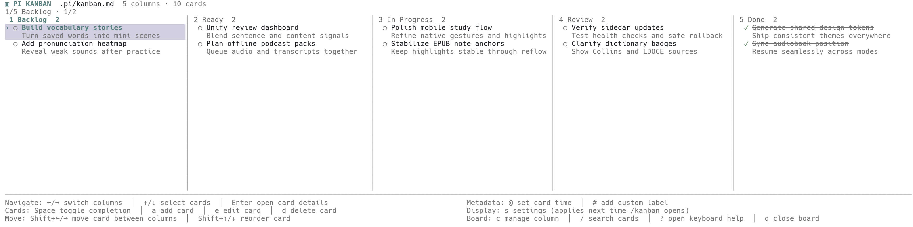

[English](README.md) | **简体中文**

# pi-kanban0

pi-kanban0 是一个给 [Pi](https://pi.dev/) 用的项目内 Kanban：纯键盘 TUI、agent 可操作、Markdown 本地存储。不启动服务，不建数据库，也不要求安装 Obsidian。



## 安装与开发

要求 Pi `0.83.0+` 和 Node.js `22.19.0+`。

从 npm 安装：

```powershell
pi install npm:pi-kanban0
```

卸载：

```powershell
pi remove npm:pi-kanban0
```

开发运行：

```powershell
npm install
npm run check
pi -e .\src\index.ts
```

本地开发包可使用 `pi install <本仓库路径>`。

## Pi 原生工作流

在任意项目中输入：

```text
/kanban
```

扩展按以下规则打开看板：

1. 当前项目已有 `.pi/kanban.md`：直接打开项目板。
2. 否则，如果已有全局板：直接打开全局板。
3. 两种看板都不存在：弹出纯键盘选择菜单。
   - 创建项目级看板：`<project>/.pi/kanban.md`
   - 创建全局看板：Pi 用户目录下的 `pi-kanban0/kanban.md`

Pi 的默认用户目录是 `~/.pi/agent`，因此默认全局路径为：

```text
~/.pi/agent/pi-kanban0/kanban.md
```

可以显式跳过菜单：

```text
/kanban project
/kanban global
```

默认只有五列：`Inbox → Todo → In Progress → Review → Done`。项目板适合跟随单个代码库，可以提交到 Git 或加入 `.gitignore`；全局板适合跨项目的个人工作流。两者都位于扩展安装目录之外，因此扩展更新不会触碰用户数据。面板标题会显示 `.pi/kanban.md` 或 `pi-kanban0/kanban.md`，避免混淆当前作用域。

除了 TUI，扩展还注册了 `kanban_board` 工具。用户可以直接让 Pi：

```text
把“补登录页的键盘测试”加到 Todo。
把它移到 In Progress。
把“补登录页的键盘测试”标记为完成。
给它设置时间“2026-08-04 10:00”，再添加“urgent”标签。
列出当前看板中与登录相关的卡片。
```

agent 和 TUI 的 `auto` 作用域解析相同：优先项目板，本地不存在时回退到全局板。工具也接受显式 `scope: project | global`；显式作用域不会隐式切换到另一块看板。只读 `list` 绝不会创建缺失的看板；两种板都不存在时，agent 会在写入前先询问用户选择。列表始终返回卡片时间和标签；传入 `column` 与 `includeDetails: true` 可以在一次有上限的调用中取得完整正文。完成状态使用显式的 `set_done`，避免 agent 重试时把状态意外反转；卡片或列名有歧义时，工具会拒绝猜测并要求先读取看板。

## TUI 能做什么

- 多列、自适应宽度与高度的嵌入式面板；默认在少量卡片时自动收紧，内容较多时最高约 34 行并在列内滚动，也可以固定为 6–100 行（最终仍受终端可用空间限制）。
- 为 Pi 的输入框和状态区预留底部空间，避免看板标题被挤出终端顶部；窄终端自动减少同时显示的列数。
- 底部快捷键按导航、卡片、移动和看板分行显示完整动作名称；空间不足时保留完整的键盘帮助入口，不使用难辨认的组合缩写。
- 浏览卡片、查看完整正文、添加、编辑、删除、完成或重新打开。
- 每张卡片默认最多显示两行；标题、正文、时间和标签都会按列宽自然换行，并共同使用可配置的 1–12 行上限；仅当换行后的完整内容超过上限时才以 `…` 提示。
- 在看板中选中卡片或进入详情后按 `y`，一键复制标题和完整正文，不包含时间与标签。
- 选中卡片后按 `@` 设置时间，按 `#` 添加自定义标签；两个键在详情页中同样可用。
- 在列内排序，或把卡片移动到相邻列。
- 用一个 `c` 键打开列菜单：新增、重命名、左右移动或删除列。
- 搜索所有卡片正文；`1`–`9` 直接跳到常用列。
- 所有修改立即写入本地 Markdown，并使用同目录临时文件原子替换。
- 写入前检测文件是否被其他编辑器或另一个进程修改；发生冲突时停止覆盖，可按 `r` 重载。

扩展不注册鼠标事件。添加和编辑复用 Pi 自带的多行编辑器，因此中文输入法与用户已有的 Pi 编辑键位保持一致。

## 键盘设计

主路径只使用方向键、空格、Enter 和几个常见单字母键。按 `?` 可随时查看完整帮助。

| 动作 | 键位 |
|---|---|
| 切换列 | `←` / `→`、`h` / `l`、`Tab` / `Shift+Tab` |
| 选择卡片 | `↑` / `↓`、`j` / `k`、`PgUp` / `PgDn` |
| 跳到列 | `1`–`9` |
| 首张 / 末张 | `Home` / `End`、`g` / `G` |
| 完成 / 重新打开 | `Space` |
| 移到相邻列 | `Shift+←` / `Shift+→`；兼容键位 `[` / `]` |
| 列内上移 / 下移 | `Shift+↑` / `Shift+↓`；兼容键位 `K` / `J` |
| 查看详情 | `Enter` |
| 复制选中卡片的标题和正文 | `y` |
| 添加 / 编辑 / 删除卡片 | `a` / `e` / `d` |
| 设置卡片时间 | `@` |
| 添加自定义标签 | `#` |
| 管理当前列 | `c`，随后使用 Pi 的键盘选择菜单 |
| 显示设置 | `s` |
| 搜索 | `/`；搜索状态下按 `Esc` 清除 |
| 从磁盘重载 | `r` |
| 帮助 / 关闭 | `?` / `q` 或 `Esc` |

## 显示设置

在看板中按 `s`，可以把看板总高度设为 `auto` 或 6–100 之间的固定行数，也可以把单张卡片（包含标题）的最大展示行数设为 1–12。最终高度始终不会超过终端的可用空间。高度与卡片行数不再提供直接调节快捷键，统一在这个设置菜单中修改。

为规避部分终端在 TUI 动态增高、缩短时产生的画面残留，显示设置**不会实时调整当前面板**：修改会立即保存，但要按 `q` / `Esc` 关闭看板，再次运行 `/kanban` 后才会生效。

显示设置会跨看板保存到：

```text
~/.pi/agent/pi-kanban0/settings.json
```

在 `s` 菜单中选择 **Reset display defaults**，可以恢复自动看板高度和每张卡片两行的默认值。

## 时间与标签格式

`@` 和 `#` 写入卡片自己的缩进正文，不需要 sidecar 文件。例如：

```markdown
- [ ] 发布键盘看板
    @{2026-08-04 10:00}
    #urgent
    #{release candidate}
    完成 Windows 终端验证
```

- 时间保存为 `@{...}`，内容可以是日期时间，也可以是用户自己的单行描述。
- 单词标签保存为 `#label`；包含空格的标签自动保存为 `#{custom label}`。
- 再次按 `@` 会替换已有时间；重复标签按大小写去重。
- 按 `@` 后默认选中 `Today`，直接按 `Enter` 即可写入今天日期；菜单还提供 `Now`、`Tomorrow` 和 `Custom time…`。所有快捷日期都按 Pi 进程的本地时区计算。
- 时间和标签不属于卡片标题，因此不会影响 agent 按标题查找卡片。

## 从旧 Markdown 一次性迁移

旧看板只是迁移来源，不是运行依赖。要导入已有的 Markdown 看板：

```text
/kanban import "D:\path\to\legacy-board.md"
```

扩展会验证来源，但不会修改源文件。已有项目板时导入到项目板；项目板不存在但已有全局板时导入到全局板；两者都不存在时，Pi 会弹出纯键盘菜单，让用户选择项目级或全局级目标，按 `Esc` 可取消。覆盖任何已有目标前都会先要求确认。导入后，选中的本地文件就是主数据，此后只需要 `/kanban`。

兼容格式很简单：列是顶层二级标题（`## Column`），卡片是顶层 Markdown task（`- [ ] title` 或 `- [x] title`）。多行正文与 `@{time}`、`#label` 元数据都按 Markdown task 缩进。无法识别的 YAML、代码块或其他内容会作为原始块保留，因此可以迁移常见的 Obsidian Kanban 文件，但扩展本身不依赖 Obsidian 或任何特定旧文件路径。

## 致谢

感谢 [LINUX DO](https://linux.do/) 社区。
