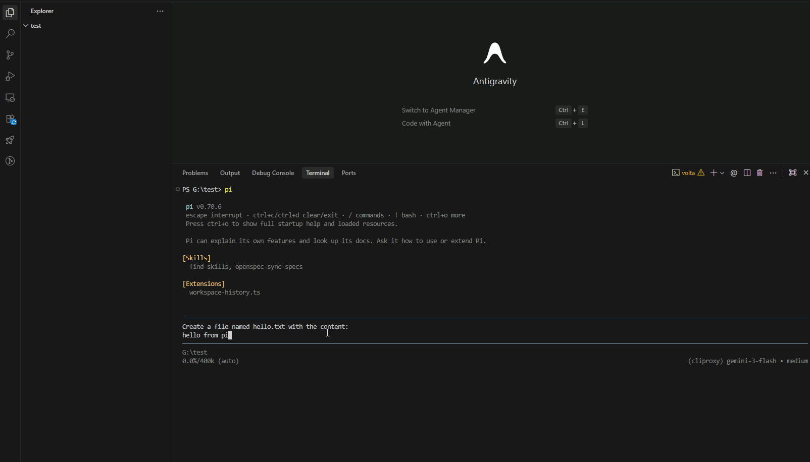

# pi-workspace-history

[Chinese version / 中文版](./README.zh-CN.md)

Real workspace undo/redo for Pi.

Bring OpenCode style `/undo` to Pi, with the kind of workspace rollback safety that makes Claude Code feel trustworthy.



## Why It Matters

- Undo the real workspace, not just chat history
- Roll back agent turns with confidence
- Restore branch-specific workspace state with `/tree`
- Rewind conversation context without discarding current files
- Protect manual edits with `/checkpoint`

## What It Is

`workspace-history` is a workspace history plugin for `@earendil-works/pi-coding-agent` 0.84.4 or newer. It requires Node.js 22.19.0 or newer.

It is not just an extra `/undo` command. The goal is to keep chat history navigation and real workspace state coordinated, while letting the user choose whether a navigation should restore files or keep the current workspace.

Its core goal is:

```text
When the user navigates to any node in the chat history tree,
they can restore both conversation and workspace state,
or rewind only the conversation while keeping current files.
```

In other words:

- `/tree` is the actual time machine
- `/undo` is a shortcut that moves one step backward through `/tree`
- `/redo` moves back to the location that was just undone

## Why It Exists

When using an agent for coding, these problems happen often:

- The agent breaks working code
- The agent deletes files by mistake
- The agent creates many useless files
- You want to go back to an earlier branch and try a different path
- You manually edit, create, or delete files between agent turns
- You do not want bad context to keep affecting later reasoning

This plugin does not try to solve simple text-editor undo. It coordinates whole-workspace snapshots with chat history navigation, including conversation-only rewinds that preserve current files.

Its value is:

- `/undo` can revert a whole agent turn instead of partially rolling back files
- `/tree` becomes real workspace history navigation, not just chat navigation
- You can move safely between historical branches
- Manual changes made between agent turns are preserved correctly
- Plugin state stays isolated from the user project Git history

## Requirements It Is Designed Around

This plugin is built around the following concrete requirements:

1. Record a `before` snapshot before each agent turn starts.
2. Record an `after` snapshot after each agent turn completes.
3. Let the user choose whether `/tree` or `/undo` restores both conversation and workspace, or conversation only.
4. When workspace restore is selected, `/undo` must restore the real state from before that turn started, not just the previous post-agent state.
5. If the user manually deletes files, edits code, or creates files before the next prompt, those changes must be captured in the next `before` snapshot.
6. If the workspace contains unsnapshotted manual changes, workspace restore must not silently overwrite them. Conversation-only navigation preserves and anchors those changes automatically.
7. Internal plugin state must stay isolated from the user project's main Git history.
8. Multiple sessions must be isolated so snapshots and redo state do not leak across sessions.

## Main Features

- `/undo`
  - Choose between restoring conversation and workspace together or rewinding conversation only
  - The existing combined restore is the first/default choice
  - Put the original user prompt back into the editor for retrying
  - Treat the original prompt, every tool round, automatic retries, compaction continuation, and queued `steer` / `followUp` input as one operation

- `/redo`
  - Restore the location that was just undone
  - Reuse the mode chosen by `/undo`, without asking again

- `/checkpoint [label]`
  - Save the current workspace as a manual checkpoint
  - Protect manual changes before the next prompt is sent

- Workspace restore through `/tree`
  - Choose whether to restore the matching workspace state after selecting a history node
  - Applies to `/tree` and Pi's double-Escape tree shortcut
  - Supports moving between historical branches
  - Branch summaries are supported with conversation-only navigation; combined workspace restore remains blocked when a summary is requested because summary generation can still be cancelled before chat navigation completes
  - If recovery from an earlier interrupted restore is still pending, summary navigation is cancelled without changing files; retry without a summary or preserve later edits with `/checkpoint`
  - Resolve user, assistant, tool result, custom message, compaction, and branch-summary nodes to their exact operation snapshot; cancel when no exact semantic anchor is available

- Dirty guard
  - Blocks risky workspace restore when the workspace contains unsnapshotted manual changes
  - Conversation-only navigation keeps and snapshots those changes instead of overwriting them

- Session isolation
  - Each session uses its own shadow git and redo state
  - Prevents a new session from undoing into an older session's history

## How It Works

The plugin stores snapshots in an internal shadow git repository instead of relying on the user's project `.git` history.

A single undo unit lasts from the original prompt until Pi reports that the agent is settled. Intermediate tool rounds receive their own tree anchors, but queued input never replaces the operation's original prompt or `before` snapshot. One `/undo` therefore removes the complete result of a multi-round operation, and `/redo` restores it as a unit.

For conversation-only navigation without a branch summary, the plugin first resolves any pending recovery from an earlier interrupted restore. If files changed after that interrupted restore, those later edits are kept automatically. The plugin then snapshots the current files before moving the conversation and uses the snapshot as the seed of the continued history branch. Once the conversation continues, its normal visible message nodes restore that kept workspace state through `/tree`. Cancelling the choice leaves both conversation and workspace unchanged. In non-interactive modes, navigation keeps the previous combined conversation-and-workspace behavior.

Default snapshot scope:

- Git tracked files
- Untracked files that are not ignored
- Paths matched by the workspace `.gitignore` are filtered out even if they were previously snapshotted

Default exclusions:

- `.git/`
- `.pi/workspace-history/`
- `node_modules/`
- `dist/`
- `build/`
- `.cache/`
- `.next/`
- `.turbo/`
- `coverage/`
- `.env`
- `.env.*`

These are hard exclusions. A workspace `.gitignore` rule such as `!.env.local` or `!node_modules/example.js` cannot add them back. Upgraded installations also prune previously tracked excluded paths from new snapshots; restoring an older snapshot never overwrites the current excluded files.

During restore, the plugin restores only the managed file set instead of doing a broad destructive cleanup of the entire workspace.

On Windows, restore operations retry briefly locked managed files. If a lock persists, navigation is cancelled without skipping the file and the notification identifies the Git file operation that failed. Pending recovery survives a session or extension reload; edits made after the failed restore are never overwritten automatically and can be preserved with `/checkpoint`.

The plugin validates each session's shadow repository before using it. If the current session repository or the workspace reusable repository is invalid, it is preserved beside the replacement as `repo.git.invalid-<timestamp>-<uuid>` and a usable repository is rebuilt automatically. Snapshotting then continues normally, but older snapshots stored only in the invalid repository may be unavailable. Invalid repositories belonging to other sessions are skipped without modifying them.

## Configuration

Configure via Pi settings:

- Global: `~/.pi/agent/settings.json`
- Project: `.pi/settings.json`

Example:

```json
{
  "workspaceHistory": {
    "storageDir": "D:\\pi-history",
    "maxSessionsPerWorkspace": 3,
    "maxWorkspaces": 10
  }
}
```

Settings:

- `workspaceHistory.storageDir`
  - External storage root for shadow history
  - Default: `~/.pi/agent/state/workspace-history`
  - Must be outside the workspace. If it is the workspace itself or a descendant, the plugin is disabled even when `enabled` is `true`, and no history directory is created there.
- `workspaceHistory.maxSessionsPerWorkspace`
  - Keep only the most recently used sessions per workspace
  - Default: `3`
- `workspaceHistory.maxWorkspaces`
  - Keep only the most recently used workspaces globally
  - Default: `10`
- `workspaceHistory.enabled`
  - `auto` (default) enables the plugin when the current directory or an ancestor contains a declared project marker
  - `true` forces it on
  - `false` disables it completely
- `workspaceHistory.allowHomeDirectory`
  - Allow enabling in the user home directory
  - Default: `false`
- `workspaceHistory.requireProjectMarker`
  - Require a project marker such as `.git`, `package.json`, `Cargo.toml`, `go.mod`, or `pyproject.toml` in the current directory or an ancestor
  - Default: `true`
  - When `false`, automatic mode accepts any directory except a filesystem root or the user home directory (unless `allowHomeDirectory` is also enabled)
- `workspaceHistory.maxScanFiles` / `workspaceHistory.maxScanDirs` / `workspaceHistory.maxScanMs`
  - Safety budget for workspace scanning
- `workspaceHistory.gitTimeoutMs`
  - Timeout for internal git operations

## Installation And Usage

Install from a package source:

```bash
pi install npm:pi-workspace-history
```

After publishing this package to npm, users can install it directly with the command above.

Or install from a local checkout:

```bash
pi install /path/to/workspace-history
```

## Local Development

This repository is also configured for direct local extension loading while developing:

```text
.pi/extensions/workspace-history.ts
.pi/settings.json
```

Start `pi` in this directory, or run `/reload` to test local changes.

You can also place `workspace-history.ts` in:

- `~/.pi/agent/extensions/`
- `.pi/extensions/`

## Testing

Development and CI use `@earendil-works/pi-coding-agent` 0.84.4 and Node.js 22.19.0. CI runs on both Linux and Windows.

Run automated tests:

```bash
npm test
```

Run type checking:

```bash
npm run typecheck
```

## Recent Changes

- Complete multi-round agent operations now form one undo/redo unit
- Hard exclusions remain unmanaged even when `.gitignore` contains negation rules
- Project markers are detected in ancestor directories for Git, Rust, Go, Python, and other declared project types
- Invalid shadow repositories are quarantined and rebuilt automatically

## Storage Layout

The plugin stores history outside the workspace by default:

```text
~/.pi/agent/state/workspace-history/
  workspaces/
    <workspaceHash>/
      meta.json
      sessions/
        <sessionId>/
          repo.git/
          redo.json
          meta.json
  logs/
    timemachine.log
```

Notes:

- History is isolated from the user's project `.git` history
- Invalid shadow repositories are preserved as `repo.git.invalid-<timestamp>-<uuid>` when automatic recovery is needed
- Old workspace-local `.pi/workspace-history/` state is not migrated automatically
- Cleanup is LRU-style based on recent use
- Retention cleanup deletes only non-current entries with valid metadata; entries with damaged metadata are kept for manual recovery
- In `auto` mode, the plugin disables itself in broad directories like the user home folder to avoid expensive scans and startup stalls
